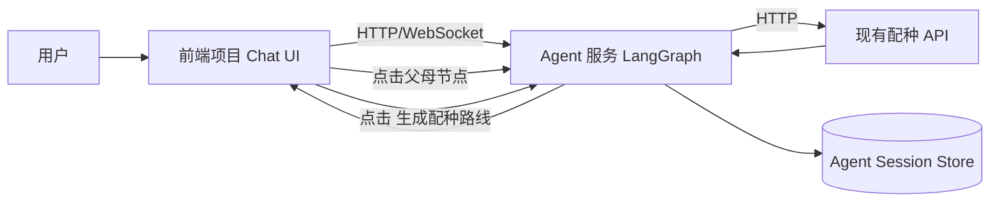

# 聊天式配种 Agent 开发架构设计

> 版本: v1.1 | 日期: 2026-08-01 | 状态: 开发设计基线（双项目版）
> 来源需求: AGENT_BREEDING_CHAT_REQUIREMENTS.md v1.1

---

## 1. 设计目标

本设计用于指导“聊天式配种 Agent”开发落地，覆盖以下能力：

1. 用户输入“手工等级最高的帕鲁怎么配种”后，自动识别目标并返回父母候选。
2. 父母节点支持 UI 原生点击，点击后继续查询该节点父母。
3. 支持多轮点击扩展并具备循环保护。
4. 用户点击“生成配种路线”后，基于会话历史输出路线图。

---

## 2. 已确认的产品决策（来自需求文档开放问题）

- 最高等级并列处理：返回 Top-3 候选并要求用户二次确认。
- 点击方式：采用聊天 UI 原生可点击能力。
- 默认深度上限：10（可配置）。

## 2.1 项目形态决策

- 采用两个独立项目：
  - 项目 A：Agent 服务（LangGraph 编排 + 会话状态 + 路线汇总）
  - 项目 B：前端项目（聊天 UI + 点击交互 + 路线图展示）
- 现有配种 API 作为第三方依赖服务，由 Agent 服务调用。

这些决策在实现中视为硬约束。

---

## 3. 总体架构

架构分层：

1. 前端项目：聊天 UI（输入、父母点击、生成路线按钮、路线图渲染）。
2. Agent 服务项目：LangGraph 编排（意图识别、查询、状态管理、汇总）。
3. 数据服务：复用现有配种 API，不直接连数据库。

## 3.1 服务边界

- 前端项目不直接调用配种 API，只调用 Agent 服务。
- Agent 服务负责业务编排和状态，不承载前端视图细节。
- 配种 API 专注数据查询，不感知会话与点击轨迹。

---

## 4. LangGraph 工作流设计

## 4.1 节点定义

- ParseIntentNode
  - 输入：用户消息
  - 输出：intent、query constraints
- ResolveTopCandidateNode
  - 输入：工种最高类 intent
  - 输出：Top-3 候选或唯一目标
- QueryParentsNode
  - 输入：pal_id
  - 输出：父母候选列表
- RenderClickableNode
  - 输出：可点击父母列表消息
- HandleExpandClickNode
  - 输入：clicked pal_id
  - 输出：下一层父母候选
- SummarizeRouteNode
  - 输入：session graph
  - 输出：文本树 + 结构化图数据

## 4.2 路由规则

1. 首问 intent 为“工种最高配种”时：
   - 先走 ResolveTopCandidateNode。
   - 若唯一目标，直接查询父母。
   - 若多目标，先返回候选确认消息。
2. 收到点击事件：
   - 进入 HandleExpandClickNode，再回到 QueryParentsNode。
3. 收到“生成配种路线”动作：
   - 进入 SummarizeRouteNode。

## 4.3 中断与恢复

- 每次查询和点击后都持久化 session graph。
- SummarizeRouteNode 失败不破坏已有状态。
- 恢复时从 session_id 读取最近完整状态快照。

---

## 5. 会话状态设计

推荐状态结构：

- session_id
- target_pal
- target_candidates: [{pal_id, score, reason}]（Top-3）
- confirmed_target_pal
- explored_nodes: set
- edges: [{child_pal_id, parent_a_id, parent_b_id, method, depth}]
- click_trace: [{pal_id, ts}]
- depth_guard: {max_depth: 10, max_nodes: 200}
- ui_capabilities: {native_click: true}

状态约束：

- 未确认目标时禁止深入展开。
- 同节点重复展开时复用缓存并提示“已查询”。
- depth > 10 或 nodes > 200 时停止自动扩展。

---

## 6. API 集成设计

复用现有 API：

1. POST /api/query
- 用途：解析“手工最高”并获取候选/目标。

2. GET /api/breeding/tree/{pal_id}
- 用途：获取点击节点的父母候选。

3. GET /api/pal/{pal_id}
- 用途：补全展示信息（可选）。

Agent 服务对前端暴露建议接口：

1. POST /agent/chat
- 输入：自然语言文本、session_id。
- 输出：消息列表（含可点击父母动作）。

2. POST /agent/action
- 输入：session_id、action，以及按动作区分的字段。
  - action=expand_parent: 必填 pal_id、source_message_id
  - action=summarize_route: 必填 mode（MVP 固定 explored_only）
- 输出：下一条 Agent 消息或路线汇总。

调用策略：

- 读请求优先走缓存（session 内）。
- API 超时后最多重试 1 次。
- 失败时返回可操作提示，不清空当前图。

---

## 7. 交互契约

## 7.1 点击事件协议

- action: expand_parent
- pal_id: string
- source_message_id: string
- session_id: string

## 7.2 生成路线动作协议

- action: summarize_route
- mode: explored_only | auto_complete
- session_id: string

MVP 固定 mode=explored_only。

## 7.3 前端与 Agent 服务契约原则

- 前端只传递用户输入和动作，不传递业务推理结果。
- Agent 服务返回可展示消息与动作元数据（按钮配置、节点状态）。
- 所有动作必须带 session_id，确保跨请求状态连续。

---

## 8. 路线生成算法约束

- 输入：当前会话已探索 edges。
- 输出：
  - 文本树（人类可读）
  - graph_json（前端可视化）
- 默认不自动补全未点击分支。
- 若后续开启自动补全，必须受 max_depth 与 max_nodes 限制。

---

## 9. 可观测性设计

核心指标：

- intent_parse_success_rate
- top3_confirm_rate
- expand_click_success_rate
- route_summarize_success_rate
- p95_latency_query
- p95_latency_expand
- p95_latency_summarize

日志字段：

- session_id, action, pal_id, latency_ms, depth, node_count, error_code

---

## 10. 风险与对策

1. 并列最高导致路径分叉过多
- 对策：固定 Top-3 + 必须确认目标后再展开。

2. 用户频繁点击导致会话图膨胀
- 对策：max_nodes 限制 + 缓存复用 + 重复点击节流。

3. 路线汇总输出过长
- 对策：默认显示摘要，支持“展开全部”二级展示。

4. 上游 API 超时
- 对策：单次重试 + 返回部分结果 + 不丢状态。

---

## 11. 开发阶段建议

- Phase 1: 首问 + Top-3 确认 + 单击展开。
- Phase 2: 多轮展开 + 去重 + 恢复。
- Phase 3: 生成路线按钮 + 图输出。
- Phase 4: 可观测性与性能优化。

---

## 12. 与现有系统关系

- 不替换现有 API，只新增独立 Agent 服务项目。
- 不改数据库模型与 ORM 查询服务。
- 前端作为独立项目，新增“父母节点可点击”与“生成配种路线”按钮，并仅对接 Agent 服务。

---

## 13. agent-service 专项开发文档

- 入口索引: `docs/architecture/agent-service/README.md`
- 适用范围: 仅 `agent-service` 项目，不包含前端实现细节。
