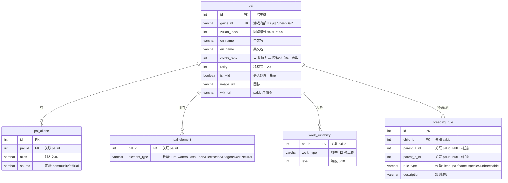

# 数据库设计文档

> 版本: v1.1 | 日期: 2026-07-31 | 状态: 设计完成 (已审查修复)

---

## 目录

1. [概述](#1-概述)
2. [实体关系图 (ERD)](#2-实体关系图-erd)
3. [表结构定义](#3-表结构定义)
4. [核心查询与索引策略](#4-核心查询与索引策略)
5. [设计决策记录](#5-设计决策记录)
6. [数据迁移路径](#6-数据迁移路径)

---

## 1. 概述

### 1.1 数据规模

| 指标 | 数值 |
|------|:---:|
| 帕鲁总数 | ~300 |
| 工作类型 | 12 种 (固定) |
| 元素类型 | 9 种 |
| 配种特殊规则 | ~20 条 |
| 别名 | ~100 条 |
| 库总大小 | < 2 MB |

### 1.2 核心场景

| 场景 | 频率 | SQL 方式 |
|------|:---:|------|
| S1: 查目标帕鲁的所有父母对 | 高 | `CROSS JOIN` + `round((a+b)/2)` |
| S2: 按工种+等级筛选帕鲁 | 高 | `JOIN work_suitability WHERE level >= N` |
| S3: 帕鲁详情 | 中 | `SELECT * FROM pal WHERE id = ?` |
| S4: 全工种统计 | 低 | `GROUP BY work_type` 聚合 |
| S5: 特殊配种规则查询 | 低 | `SELECT * FROM breeding_rule WHERE child_id = ?` |

---

## 2. 实体关系图 (ERD)



---

## 3. 表结构定义

### 3.1 `pal` — 帕鲁主表

帕鲁核心信息，一行一个帕鲁。`combi_rank` 是配种计算唯一参数。

| 列名 | 类型 | 约束 | 说明 |
|------|------|------|------|
| `id` | `SERIAL` | PK | 自增主键 |
| `game_id` | `VARCHAR(64)` | UK, NOT NULL | 游戏内部 ID，如 `SheepBall`、`MonochromeQueen` |
| `zukan_index` | `INTEGER` | NOT NULL | 图鉴编号 #001-#299 |
| `cn_name` | `VARCHAR(32)` | UNIQUE, NOT NULL | 中文名，如 "棉悠悠" |
| `en_name` | `VARCHAR(64)` | | 英文名，如 "Lamball" |
| `combi_rank` | `INTEGER` | NOT NULL, INDEX | **★ 繁殖力** — 配种公式: `round((A+B)/2)` |
| `rarity` | `INTEGER` | NOT NULL, DEFAULT 1 | 稀有度 1-20 |
| `is_wild` | `BOOLEAN` | NOT NULL, DEFAULT FALSE | 野外是否直接可捕获 |
| `image_url` | `TEXT` | | 图标 URL |
| `wiki_url` | `TEXT` | | paldb.cc 详情页 |
| `created_at` | `TIMESTAMPTZ` | NOT NULL | 创建时间 |
| `updated_at` | `TIMESTAMPTZ` | NOT NULL | 更新时间 |

**索引**:
- `pal(combi_rank)` — B-tree，配种 CROSS JOIN 用
- `pal(cn_name)` — UNIQUE + B-tree，名称查找
- `pal(zukan_index)` — B-tree，编号查找
- `pal(game_id)` — UNIQUE，游戏原始标识

### 3.2 `pal_aliase` — 别名表

帕鲁可能有多个社区别名（如 "打工皇帝" → 阿努比斯），独立存储避免污染主表。

| 列名 | 类型 | 约束 | 说明 |
|------|------|------|------|
| `id` | `SERIAL` | PK | |
| `pal_id` | `INTEGER` | FK → pal.id, NOT NULL | |
| `alias` | `VARCHAR(64)` | NOT NULL | 别名文本 |
| `source` | `VARCHAR(32)` | DEFAULT 'community' | community / official |

**索引**: `pal_aliase(pal_id)`, `pal_aliase(alias)` — 模糊搜索用

### 3.3 `pal_element` — 属性关联表

帕鲁拥有 1-2 种属性（元素），多对多关联。

| 列名 | 类型 | 约束 | 说明 |
|------|------|------|------|
| `pal_id` | `INTEGER` | FK → pal.id, PK(1/2) | |
| `element_type` | `VARCHAR(16)` | PK(2/2), NOT NULL | Fire/Water/Grass/Earth/Electric/Ice/Dragon/Dark/Neutral |

**索引**: `pal_element(pal_id)`, `pal_element(element_type)`

### 3.4 `work_suitability` — 工作适应性表

> ⭐ 场景 S2 主力表。一个帕鲁 12 行（每工种一行），共 ~3600 行。

| 列名 | 类型 | 约束 | 说明 |
|------|------|------|------|
| `pal_id` | `INTEGER` | FK → pal.id, PK(1/2), CASCADE | |
| `work_type` | `VARCHAR(32)` | PK(2/2), NOT NULL | 12 种枚举 |
| `level` | `INTEGER` | NOT NULL, DEFAULT 0, CHECK(level >= 0) | 0-10，0 = 无此适应性（存储含 0 的行避免 12 行稀疏） |

`work_type` 枚举值:

| 英文键 | 中文名 |
|------|------|
| `handiwork` | 手工 |
| `kindling` | 生火 |
| `watering` | 浇水 |
| `planting` | 播种 |
| `generating_electricity` | 发电 |
| `gathering` | 采集 |
| `lumbering` | 伐木 |
| `mining` | 采矿 |
| `cooling` | 冷却 |
| `medicine` | 制药 |
| `transporting` | 搬运 |
| `farming` | 畜牧 |

**索引**: `work_suitability(work_type, level DESC)` — ★ 核心索引，覆盖 S2 筛选+排序

### 3.5 `breeding_rule` — 配种特殊规则表

大部分帕鲁走 CombiRank 公式，少数需要特殊规则：

| rule_type | 示例 | parent_a | parent_b |
|-----------|------|----------|----------|
| `fixed_pair` | 雷隐鹿 = 棉悠悠 + 捣蛋猫 (固定组合) | 棉悠悠 pal.id | 捣蛋猫 pal.id |
| `same_species` | 唤冬兽只能同类繁殖 | 唤冬兽 pal.id | 唤冬兽 pal.id |
| `unbreedable` | Boss 帕鲁不可配种 | NULL | NULL |

| 列名 | 类型 | 约束 | 说明 |
|------|------|------|------|
| `id` | `SERIAL` | PK | |
| `child_id` | `INTEGER` | FK → pal.id, NOT NULL | 子代 |
| `parent_a_id` | `INTEGER` | FK → pal.id | 父代 A，NULL = 不限 |
| `parent_b_id` | `INTEGER` | FK → pal.id | 父代 B，NULL = 不限 |
| `rule_type` | `VARCHAR(32)` | NOT NULL | fixed_pair / same_species / unbreedable |
| `description` | `TEXT` | | 人类可读说明 |

**索引**: `breeding_rule(child_id)`, `breeding_rule(child_id, rule_type)` — UNIQUE 防止重复规则

---

## 4. 核心查询与索引策略

### 4.1 S1 — 查父母对

配种查询分两步：先查特殊规则表，命中则直接返回；否则走 CombiRank 公式。

```sql
-- 第 0 步: 查特殊规则 (API 先执行此查询)
SELECT rule_type, parent_a_id, parent_b_id
FROM breeding_rule
WHERE child_id = $pal_id;  -- $pal_id 为 pal.id (SERIAL)

-- 如果 rule_type = 'unbreedable' → 直接返回空集，不执行后续 SQL
-- 如果 rule_type = 'same_species' → 返回 [(self, self)]
-- 如果 rule_type = 'fixed_pair' → 返回固定父母对

-- 第 1 步: 默认公式 — 无特殊规则时走此 SQL
SELECT
    a.cn_name AS parent_a,
    b.cn_name AS parent_b,
    a.combi_rank AS rank_a,
    b.combi_rank AS rank_b
FROM pal a
CROSS JOIN pal b
WHERE round((a.combi_rank + b.combi_rank) / 2.0) = $target_rank
  AND a.id < b.id           -- 去重 A+B=B+A
  AND a.id <> $pal_id       -- 排除自指 (统一用 pal.id)
  AND b.id <> $pal_id
ORDER BY a.combi_rank;
```

| 项目 | 说明 |
|------|------|
| 算法 | `round((父A.rank + 父B.rank) / 2)` = 子代.rank |
| 守卫 | 先查 `breeding_rule` — `unbreedable` 直接返回空; `same_species`/`fixed_pair` 固定返回 |
| 扫描 | 全表 CROSS JOIN ~90K 组合，每行仅数值比较 |
| 索引 | `pal(combi_rank)` — 数值运算确定性高 |
| 耗时 | ~10-50ms (实测 PG 16 + 300 行) |
| 边界 | `round()` 四舍五入，等距时(如 rank 3 和 5 的均值 4)选近端。游戏实际可能有微调，此处为已知简化 |

### 4.2 S2 — 按工种等级筛选

```sql
-- 场景 A: 单工种筛选 "手工 ≥ 6"
SELECT p.cn_name, p.combi_rank, ws.level
FROM pal p
JOIN work_suitability ws ON p.id = ws.pal_id
WHERE ws.work_type = 'handiwork'
  AND ws.level >= 6
ORDER BY ws.level DESC, p.combi_rank;

-- 场景 B: 多工种组合 "手工 ≥ 6 且 采矿 ≥ 4"
SELECT p.cn_name, h.level AS handiwork_lv, m.level AS mining_lv
FROM pal p
JOIN work_suitability h ON p.id = h.pal_id
    AND h.work_type = 'handiwork' AND h.level >= 6
JOIN work_suitability m ON p.id = m.pal_id
    AND m.work_type = 'mining'   AND m.level >= 4;

-- 场景 C: 最高等级查询 "哪个帕鲁手工最强?"
SELECT p.cn_name, ws.level
FROM pal p
JOIN work_suitability ws ON p.id = ws.pal_id
WHERE ws.work_type = 'handiwork'
ORDER BY ws.level DESC
LIMIT 1;
```

| 索引 | 覆盖场景 |
|------|------|
| `work_suitability(work_type, level DESC)` | S2-A/B/C 全部覆盖 |
| 为什么是 `DESC` | 等级查询通常是 "≥N" 或 "最高前N"，降序排列命中更多需求 |

### 4.3 S3 — 帕鲁详情

```sql
SELECT p.*,
       array_agg(pe.element_type) AS elements,
       jsonb_object_agg(ws.work_type, ws.level)
           FILTER (WHERE ws.level > 0) AS work_suitability
FROM pal p
LEFT JOIN pal_element pe ON p.id = pe.pal_id
LEFT JOIN work_suitability ws ON p.id = ws.pal_id
WHERE p.game_id = 'Anubis'
GROUP BY p.id;
```

> 一次查询拼装完整 Pal 对象（属性 + 工作适应性）。

> **Python 适配**: `jsonb_object_agg` 返回的 `{"handiwork": 6}` 需转为 `WorkSuitability(handiwork=6)`，在 adapter 层处理。

### 4.4 S4 — 全工种统计

```sql
SELECT work_type,
       MAX(level)            AS max_level,
       ROUND(AVG(level), 1)  AS avg_level,
       COUNT(*) FILTER (WHERE level > 0) AS pal_count
FROM work_suitability
GROUP BY work_type
ORDER BY max_level DESC;
```

| 索引 | 说明 |
|------|------|
| `work_suitability(work_type, level)` | GROUP BY work_type + MAX(level) 走 Loose Index Scan |

---

## 5. 设计决策记录

### 5.1 为什么 `work_suitability` 拆成独立表而非主表宽列？

| 方案 | 主表宽列 (当前) | 独立表 (设计) |
|------|:---:|:---:|
| 添加新工种 | ALTER TABLE 加列 | INSERT 一行 |
| 索引 | 每工种建一个索引 (12 个) | 一个复合索引覆盖全部 |
| 组合查询 | 12 个 WHERE 子句 | `JOIN ... JOIN` 清晰 |
| 扩展性 | 差 | 好 |
| ORM 映射 | Pal 对象 12 个字段 | Pal 对象 + `List<WorkSuitability>` |

**结论**: 12 种工种是固定集合，但独立表在索引、查询、扩展性上全面优于宽列。

### 5.2 为什么 `pal_element` 不放在主表？

| 方案 | 主表 `TEXT[]` | 独立表 |
|------|:---:|:---:|
| 查询 "所有火属性帕鲁" | `WHERE 'Fire' = ANY(elements)` | `JOIN pal_element WHERE element_type='Fire'` |
| 索引 | GIN 索引 | 普通 B-tree |
| 数据量 | 内联存储 | ~600 行独立表 |

**结论**: 9 种属性，帕鲁 1-2 种，独立表更规范且 B-tree 索引比 GIN 更高效。

### 5.3 为什么统一使用 `pal.id` (SERIAL) 作外键？

所有子表（`pal_aliase`、`pal_element`、`work_suitability`、`breeding_rule`）统一引用 `pal.id`：

- **JOIN 效率**: INT 比 VARCHAR(64) 快，索引更紧凑
- **一致性**: 一个 ERD 内 FK 指向同一列，不会出现 "用 id 还是 game_id" 的歧义
- **CASCADE**: `ON DELETE CASCADE` 在所有子表统一生效
- **对外暴露**: API 层可以通过 `pal.game_id` 对外暴露可读标识，但数据库内部 JOIN 走 INT

### 5.4 为什么不用 JSONB 存工作适应性？

当前表用 JSONB（`elements`、`aliases`）。工作适应性为什么不用？

- JSONB 存 work_suitability: `{"handiwork": 6, "mining": 4}`
- 问题: `WHERE data->>'handiwork' >= '6'` 需要 GIN 索引，且无法做数值比较
- 独立表: `WHERE work_type='handiwork' AND level >= 6` — 普通 B-tree，简单高效

### 5.5 `breeding_rule` 的 `parent_a_id` / `parent_b_id` 可为 NULL 的设计

| rule_type | parent_a_id | parent_b_id | 含义 |
|-----------|:---:|:---:|------|
| `fixed_pair` | 棉悠悠的 pal.id | 捣蛋猫的 pal.id | 固定组合，必须两者配对 |
| `same_species` | 唤冬兽的 pal.id | 唤冬兽的 pal.id | 只能同类繁殖 |
| `unbreedable` | NULL | NULL | Boss 帕鲁不可配种 |

NULL 表示 "任意" 或 "不适用"。查询时: 先查 `breeding_rule`，命中则跳过 CombiRank 公式。

---

## 6. 数据迁移路径

### 当前状态

```
pal (宽表, 12 工种列 + JSONB elements + JSONB aliases)
```

### 目标状态

```
pal ─── pal_aliase
     ─── pal_element
     ─── work_suitability
     ─── breeding_rule
```

### 迁移步骤 (SQL)

```sql
BEGIN;  -- 事务包装，失败自动回滚

-- 1. 建新表
CREATE TABLE pal_new (...);
CREATE TABLE pal_aliase (...);
CREATE TABLE pal_element (...);
CREATE TABLE work_suitability (...);
CREATE TABLE breeding_rule (...);

-- 2. 迁移主表数据
INSERT INTO pal_new (game_id, zukan_index, cn_name, en_name,
                     combi_rank, rarity, is_wild, image_url, wiki_url)
SELECT id, number, cn_name, en_name,
       combi_rank, rarity, is_wild, image_url, wiki_url
FROM pal;

-- 3. 迁移属性 (JSONB → 行)
INSERT INTO pal_element (pal_id, element_type)
SELECT pn.id, e.value
FROM pal p
JOIN pal_new pn ON pn.game_id = p.id
CROSS JOIN LATERAL jsonb_array_elements_text(p.elements) AS e(value);

-- 4. 迁移工作适应性 (宽列 → 行)
INSERT INTO work_suitability (pal_id, work_type, level)
SELECT pn.id, t.work_type, t.level
FROM pal p
JOIN pal_new pn ON pn.game_id = p.id
CROSS JOIN LATERAL (VALUES
    ('handiwork', p.handiwork),
    ('kindling', p.kindling),
    ('watering', p.watering),
    ('planting', p.planting),
    ('generating_electricity', p.generating_electricity),
    ('gathering', p.gathering),
    ('lumbering', p.lumbering),
    ('mining', p.mining),
    ('cooling', p.cooling),
    ('medicine', p.medicine),
    ('transporting', p.transporting),
    ('farming', p.farming)
) AS t(work_type, level);

-- 5. 替换旧表
DROP TABLE pal;
ALTER TABLE pal_new RENAME TO pal;

COMMIT;
```

---

## 附录: DDL 参考

```sql
-- pal
CREATE TABLE pal (
    id          SERIAL PRIMARY KEY,
    game_id     VARCHAR(64) UNIQUE NOT NULL,
    zukan_index INTEGER NOT NULL,
    cn_name     VARCHAR(32) UNIQUE NOT NULL,
    en_name     VARCHAR(64),
    combi_rank  INTEGER NOT NULL,
    rarity      INTEGER NOT NULL DEFAULT 1,
    is_wild     BOOLEAN NOT NULL DEFAULT FALSE,
    image_url   TEXT,
    wiki_url    TEXT,
    created_at  TIMESTAMPTZ NOT NULL DEFAULT NOW(),
    updated_at  TIMESTAMPTZ NOT NULL DEFAULT NOW()
);
CREATE INDEX idx_pal_combi_rank ON pal(combi_rank);
CREATE INDEX idx_pal_cn_name ON pal(cn_name);
CREATE INDEX idx_pal_zukan_index ON pal(zukan_index);

-- pal_aliase
CREATE TABLE pal_aliase (
    id      SERIAL PRIMARY KEY,
    pal_id  INTEGER NOT NULL REFERENCES pal(id) ON DELETE CASCADE,
    alias   VARCHAR(64) NOT NULL,
    source  VARCHAR(32) DEFAULT 'community'
);
CREATE INDEX idx_aliase_pal_id ON pal_aliase(pal_id);
CREATE INDEX idx_aliase_alias ON pal_aliase(alias);

-- pal_element
CREATE TABLE pal_element (
    pal_id       INTEGER NOT NULL REFERENCES pal(id) ON DELETE CASCADE,
    element_type VARCHAR(16) NOT NULL,
    PRIMARY KEY (pal_id, element_type)
);
CREATE INDEX idx_element_type ON pal_element(element_type);

-- work_suitability
CREATE TABLE work_suitability (
    pal_id    INTEGER NOT NULL REFERENCES pal(id) ON DELETE CASCADE,
    work_type VARCHAR(32) NOT NULL,
    level     INTEGER NOT NULL DEFAULT 0 CHECK (level >= 0),
    PRIMARY KEY (pal_id, work_type)
);
CREATE INDEX idx_ws_type_level ON work_suitability(work_type, level DESC);

-- breeding_rule
CREATE TABLE breeding_rule (
    id           SERIAL PRIMARY KEY,
    child_id     INTEGER NOT NULL REFERENCES pal(id) ON DELETE CASCADE,
    parent_a_id  INTEGER REFERENCES pal(id),
    parent_b_id  INTEGER REFERENCES pal(id),
    rule_type    VARCHAR(32) NOT NULL,
    description  TEXT
);
CREATE INDEX idx_rule_child ON breeding_rule(child_id);
CREATE UNIQUE INDEX idx_rule_child_type ON breeding_rule(child_id, rule_type);
```
