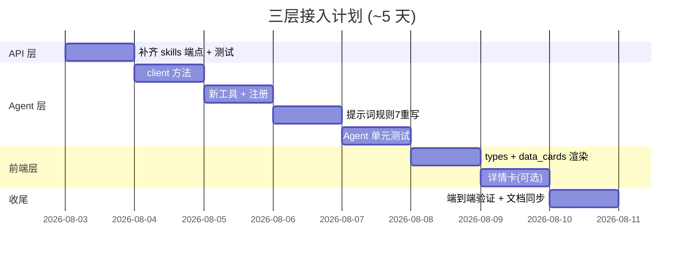

# 三层接入计划 — API / Agent / 前端 接入 tc-imba 新数据能力

> 版本: v1.0 | 日期: 2026-08-02 | 状态: 规划中
> 背景: 数据库 22 表 + S6-S10 查询已落地（feature/tcimba-22tables），本计划将新数据能力接入 API / Agent / 前端三层
> 前置: [DATABASE_DESIGN_TCIMBA_V2.md](./DATABASE_DESIGN_TCIMBA_V2.md)、[TCIMBA_DATA_DEVELOPMENT_PLAN.md](./TCIMBA_DATA_DEVELOPMENT_PLAN.md)

---

## 1. 目标与能力清单

将 22 表新数据通过三层触达用户，形成完整链路：

| 能力 | 数据 | API 端点 | Agent 工具 | 前端 |
|------|------|----------|-----------|------|
| S6 配种被动传承 | passive + pal_passive | `/api/passives?name=` | `query_pals_by_passive` | 聊天展示 |
| S7 帕鲁技能 | skill + pal_skill | `/api/pals/{id}/skills` | `query_pal_skills` | 聊天展示 |
| S8 掉落反查 | item + pal_drop | `/api/items/{name}/drops` | `query_item_drops` | 聊天展示 |
| S9 配方链 | item_recipe* | `/api/items/{name}/recipe` | `query_item_recipe` | 聊天展示 |
| S10 帕鲁全量详情 | 全部详情表 | `/api/pals/{id}/detail` | `query_pal_detail` | 详情卡片 |

---

## 2. 现状分析

### 2.1 API 层（已完成 ✅）

`packages/api/pl_agent/api/routes/query.py` 已提供新端点（P6 完成）：

| 端点 | 说明 |
|------|------|
| `GET /api/pals/{pal_id}/detail` | S10 全量详情（stats/技能/被动/掉落/伙伴技能/召唤）|
| `GET /api/passives?name=中文名` | S6 按被动查帕鲁 |
| `GET /api/items/{item_name}/recipe` | S9 配方链 |
| `GET /api/items/{item_name}/drops` | S8b 掉落反查 |

**缺口**: 无 `/api/pals/{id}/skills`（技能已并入 detail）；Agent 层尚未调用这些端点。

### 2.2 Agent 层（需扩展 🔧）

`packages/agent/pl_agent/agent/`：

- **工具** `tools/breeding.py`：现有 3 个
  - `query_parent_pairs` / `resolve_pal` / `query_top_suitability`
- **上游 client** `clients/breeding_api_client.py`：现有方法
  - `query_top_suitability` / `get_parent_pairs` / `resolve_pal_name` / `get_pal_detail`(旧 /api/pal/{id}) / `resolve_pal` / `query_stats`
- **提示词** `prompts/assistant.md`：
  - **规则 7 当前缺陷**: "石头怎么获取/木材在哪捡" 等被归类为**配种外话题 → LLM 凭通用知识直接回答**
  - **应改为**: 调用 `query_item_drops` / `query_item_recipe` 查**精确数据**，而非凭记忆
  - **规则 8 过时**: 仍写"权威数据库（paldb.cc）"，数据源已切 tc-imba，需一并更新
- **服务层** `packages/agent-web`：FastAPI 层，`/agent/chat` 响应组装 `AgentData`（含 actions/state_snapshot）；新增工具数据要到达前端，需在此透传 `data_cards`

### 2.3 前端层（需扩展 🔧）

`packages/web/src/`：

- **页面**: 仅 `pages/ChatPage.tsx`（聊天）
- **服务**: `services/agentClient.ts`（调 agent-web :9000 的 /agent/chat + /agent/chat/stream）
- **类型**: `types.ts`（PalProfile / AgentData / AgentAction / 配种树等）
- **现状**: 只展示配种树 + 候选可点击；无帕鲁详情/被动/掉落/配方展示

---

## 3. 三层改动明细

### 3.1 API 层（小改，1 天）

| 改动 | 说明 |
|------|------|
| 新增 `GET /api/pals/{id}/skills` | S7 独立端点（技能列表），调 `queries.query_pal_skills`（方法已存在，仅补路由）|
| 端点返回统一 `data` 结构 | 已符合 `format_success` 惯例，无需改 |
| 冒烟测试 | `tests/smoke/` 补新端点用例 |

> API 层主体已完成，本层主要是补齐独立 skills 端点 + 测试。

### 3.2 Agent 层（核心，2 天）

**a. 扩展 `clients/breeding_api_client.py`** 新增方法（调用新端点）：

```python
async def get_pal_detail_full(self, pal_id: str) -> dict     # GET /api/pals/{id}/detail
async def query_pals_by_passive(self, name: str) -> list     # GET /api/passives?name=
async def get_item_recipe(self, item_name: str) -> list      # GET /api/items/{name}/recipe
async def get_item_drops(self, item_name: str) -> list       # GET /api/items/{name}/drops
```

**b. 新增工具**（`tools/breeding.py` 或新建 `tools/pal_info.py`）：

| 工具名 | 作用 | 触发场景 |
|--------|------|----------|
| `query_pal_detail` | 帕鲁全量详情（S10）| "XX 的属性/技能/掉落是什么" |
| `query_pals_by_passive` | 被动→帕鲁（S6）| "哪只帕鲁有工匠精神" |
| `query_item_drops` | 物品掉落反查（S8）| "骨头哪里获得" |
| `query_item_recipe` | 配方链（S9）| "金属锭怎么做" |

注册到 `tools/registry.py`（或 workflow 组装处）。

**c. 更新 `prompts/assistant.md`**：
- **重写规则 7**: "石头怎么获取/木材在哪捡/金属锭怎么做" → 调用 `query_item_drops`/`query_item_recipe` 查精确数据；不再凭通用知识直接回答
- 新增规则: 被动/技能/掉落类问题分别调用对应工具
- 保留"配种必须走工具"等既有规则
- **同步修正规则 8**: "权威数据库（paldb.cc）" → 改为 "tc-imba（palworld.tc-imba.com）"

**d. 意图识别**：`intent/` 若需区分新意图（被动/物品/技能），评估是否扩展（可先靠 LLM function calling 自然路由，不强制改意图分类）

**e. agent-web 服务层透传**（`packages/agent-web`）：
- workflow 在工具调用后汇总结构化数据 → `AgentData.data_cards`（被动/掉落/配方/详情摘要）
- `/agent/chat` + `/agent/chat/stream` 响应体增加可选 `data_cards` 字段（不破坏现有 actions/state_snapshot）
- 前端据此渲染卡片；若不做此层，工具数据只能进回答文本、无法结构化展示

### 3.3 前端层（增量，2 天）

**a. 聊天内结构化展示**（低风险，核心价值）：
- Agent 工具返回的 detail / passive / drops / recipe 数据 → 在聊天消息内渲染小卡片（不改变现有配种树交互）
- `types.ts` 扩展 `AgentData` 增加可选 `data_cards` 字段
- `ChatPage.tsx` 渲染 data_cards（被动列表 / 掉落列表 / 配方列表 / 详情摘要）

**b. 可选：帕鲁详情卡**（中风险）：
- 消息内帕鲁名 hover / 点击 → 弹出详情卡（调 api `/api/pals/{id}/detail`）
- 复用 `agentClient` 新增 `fetchPalDetail()` 直连 api :8000

**c. 前端类型**: 新增 `PalDetail / PassiveCard / DropCard / RecipeCard` 类型

---

## 4. 分阶段计划



| 阶段 | 依赖 | 产出 |
|------|------|------|
| A API 补齐 | - | `/api/pals/{id}/skills` + smoke |
| B Agent client | A | client 4 新方法 |
| C Agent 工具 | B | 4 新工具 + registry |
| D 提示词 | C | assistant.md 规则 7 重写 |
| E 前端卡片 | C | data_cards 渲染 + types |
| F 详情卡(可选) | A | PalDetail 卡片 |
| G 收尾 | 全部 | 端到端 + 文档 |

---

## 5. 测试与验收

| 层 | 测试 | 验收 |
|----|------|------|
| API | `tests/smoke/` 新端点 | `/api/pals/Anubis/detail` 200 且含 skills/drops |
| Agent | `packages/agent/.../__tests__/` 新增工具单测（mock client）| "哪只帕鲁有工匠精神"→ 工具调用 + 中文回答 |
| Agent 集成 | tools 执行返回结构化数据 | "骨头怎么获取" → 掉落帕鲁列表（不再凭记忆）|
| 前端 | `npm run build` + TSC | 聊天内显示被动/掉落/配方卡片，无报错 |
| 端到端 | 浏览器验证 | 问答链路：被动→帕鲁→详情卡 |

---

## 6. 风险与对策

| 风险 | 等级 | 对策 |
|------|:---:|------|
| 规则 7 行为改变可能影响既有"话题切换"测试 | 中 | 同步更新 agent 测试 fixture；保留"怎么抓帕鲁"等无数据话题走通用回答 |
| 新增工具增加 LLM function calling 复杂度 | 低 | 工具描述写清楚触发场景；工具数量控制在 4 个以内 |
| 前端 data_cards 与现有配种树渲染冲突 | 中 | 独立组件 + 独立样式类，不侵入 breed-tree |
| 意图识别误路由（被动 vs 配种）| 低 | 靠 LLM 自然路由，先不加规则分支，出问题再补 |

---

## 7. 执行记录

- [ ] A: API 补齐 skills 端点 + smoke
- [ ] B: client 4 新方法
- [ ] C: 4 新工具 + 注册
- [ ] D: assistant.md 规则 7 重写
- [ ] E: 前端 data_cards + types
- [ ] F: 详情卡（可选）
- [ ] G: 端到端 + 文档同步
