# 数据库设计文档 v2.0 — tc-imba 全量数据

> 版本: v2.0 | 日期: 2026-08-02 | 状态: **已实现（P0-P6 完成，22 表已落地 + S6-S10 查询/端点已上线）**
> 数据源: [palworld.tc-imba.com](https://palworld.tc-imba.com/) → `data-palworld.tc-imba.com`
> 数据清单: 见 [TCIMBA_DATA.md](../../context/TCIMBA_DATA.md)
> 前置: v1.1 5 表规范化设计（本版在 v1.1 基础上扩展，不破坏既有 5 表）

---

## 目录

1. [概述](#1-概述)
2. [实体关系图 (ERD)](#2-实体关系图-erd)
3. [表结构定义](#3-表结构定义)
4. [核心查询与索引策略](#4-核心查询与索引策略)
5. [设计决策记录](#5-设计决策记录)
6. [数据源 → 表映射](#6-数据源--表映射)
7. [DDL 附录](#7-ddl-附录)

---

## 1. 概述

### 1.1 数据规模（tc-imba 全量）

| 指标 | 数值 |
|------|:---:|
| 帕鲁 | 299 |
| 配种独特组合 | 250（114 same_species + 136 fixed_pair）|
| 被动技能 | 115（可获取；本地化字典 152 含装备被动）|
| 技能 | 323 |
| 物品 | 2433 |
| 工作类型 | 12 种 |
| 元素类型 | 9 种 |
| 库总大小预估 | < 15 MB |

### 1.2 设计目标

在 v1.1 的 5 表（`pal` / `pal_aliase` / `pal_element` / `work_suitability` / `breeding_rule`）之上，覆盖 tc-imba 提供的**全部数据**，新增 17 张扩展表，共 **22 张表**：

- **帕鲁维度**: 基础属性 `pal_stats`、好感度 `pal_friendship`、敌方缩放 `pal_enemy_scaling`、伙伴技能 `pal_partner_skill`、召唤 `pal_summon`
- **技能维度**: `skill` + `pal_skill`（学习等级）
- **被动维度**: `passive` + `passive_effect` + `passive_invoke` + `pal_passive`（配种被动传承）
- **物品维度**: `item` + `item_recipe` + `item_recipe_station` + `item_recipe_material` + `item_source` + `pal_drop`

### 1.3 核心新增场景

| 场景 | 说明 |
|------|------|
| S6 | "配出带【工匠精神】的帕鲁" — 被动 → 帕鲁反向查询 |
| S7 | "阿努比斯能学什么技能 / 等级多少" — 帕鲁技能表 |
| S8 | "骨头哪里获取 / 哪些帕鲁掉落" — 掉落双向反查 |
| S9 | "金属锭怎么做 / 需要什么材料" — 配方链 |
| S10 | "火焰羊的伙伴技能是什么" — 伙伴技能详情 |

---

## 2. 实体关系图 (ERD)

```mermaid
erDiagram
    %% ===== v1.1 既有 5 表 =====
    pal {
        int id PK "自增主键"
        varchar game_id UK "游戏内部 ID"
        int zukan_index "图鉴编号"
        varchar zukan_index_suffix "后缀 _Fire/_Dark"
        varchar cn_name UK "中文名"
        varchar en_name "英文名"
        int combi_rank "繁殖力"
        int rarity "稀有度"
        boolean is_wild "野外可捕获"
        boolean breed_child "可作配种子代"
        varchar genus "种族"
        varchar size "体型 XS-XL"
        varchar egg "蛋类型"
        boolean nocturnal "夜行"
        varchar reaction "性格"
        varchar best_work "最佳工种"
        boolean summonable "可召唤"
        boolean predator "捕食者"
        varchar boss_first_defeat_reward "首杀奖励"
        text image_url "图标"
    }

    pal_aliase {
        int id PK
        int pal_id FK
        varchar alias
        varchar source
    }

    pal_element {
        int pal_id FK "复合PK"
        varchar element_type "复合PK"
    }

    work_suitability {
        int pal_id FK "复合PK"
        varchar work_type "复合PK"
        int level "0-10"
    }

    breeding_rule {
        int id PK
        int child_id FK
        int parent_a_id FK
        int parent_b_id FK
        varchar rule_type
        text description
    }

    %% ===== v2.0 扩展表 =====
    pal_stats {
        int pal_id PK "一对一"
        int hp "生命"
        int melee_attack "近战攻击"
        int shot_attack "远程攻击"
        int defense "防御"
        int support "辅助"
        int craft_speed "制作速度"
        int stamina "耐力"
        int food_amount "食物量"
        int max_full_stomach "饱腹度上限"
        numeric capture_rate "捕获率"
        numeric exp_ratio "经验倍率"
        int price "出售价格"
        int male_probability "雄性概率%"
        int slow_walk_speed "慢走速度"
        int walk_speed "行走速度"
        int run_speed "奔跑速度"
        int ride_sprint_speed "骑乘冲刺"
        int transport_speed "搬运速度"
        int swim_speed "游泳速度"
    }

    pal_friendship {
        int pal_id PK "一对一"
        numeric hp "HP成长"
        numeric shot_attack "攻击成长"
        numeric defense "防御成长"
    }

    pal_enemy_scaling {
        int pal_id PK "一对一"
        numeric receive_damage "受击倍率"
    }

    pal_partner_skill {
        int pal_id PK "一对一"
        varchar action_name "技能枚举"
        int effect_time "生效时长"
        int cool_time "冷却"
        int exec_cost "使用消耗"
        int idle_cost "待机消耗"
        boolean toggle "开关型"
        boolean can_throw_pal "可投掷帕鲁"
    }

    pal_summon {
        int pal_id FK "复合PK"
        int material_item_id FK "复合PK"
        int level "召唤等级"
        int count "数量"
    }

    skill {
        int id PK
        varchar waza_id UK "游戏技能 ID"
        varchar element "属性"
        varchar category "类别 Shot/Melee"
        int power "威力"
        int cool_time "冷却"
        int min_range "最小射程"
        int max_range "最大射程"
        varchar strength "强度"
        varchar effect_type "附加效果类型"
        int effect_value "效果值"
        varchar cn_name "中文名"
        text description "描述"
    }

    pal_skill {
        int pal_id FK "复合PK"
        int skill_id FK "复合PK"
        int learn_level "学习等级"
    }

    passive {
        int id PK
        varchar passive_id UK "游戏被动 ID"
        int rank "稀有度等级"
        int lottery_weight "遗传权重"
        varchar cn_name "中文名"
    }

    passive_effect {
        int id PK
        int passive_id FK
        varchar effect_type "效果类型"
        numeric effect_value "数值"
        varchar effect_target "ToSelf"
    }

    passive_invoke {
        int id PK
        int passive_id FK
        varchar invoke "触发方式"
    }

    pal_passive {
        int pal_id FK "复合PK"
        int passive_id FK "复合PK"
    }

    item {
        int id PK
        varchar item_id UK "游戏物品 ID"
        varchar type_a "大类"
        varchar type_b "子类"
        int sort_id "排序"
        int rarity "稀有度"
        int rank "等级"
        int weight "重量"
        int price "价格"
        int max_stack "堆叠上限"
        boolean handcraft "可手工制作"
        varchar cn_name "中文名"
        text description "描述"
    }

    item_recipe {
        int id PK
        int item_id FK
        int work "工作量"
        int product_count "产出数"
    }

    item_recipe_station {
        int id PK
        int recipe_id FK
        varchar station "制作设施"
    }

    item_recipe_material {
        int id PK
        int recipe_id FK
        int material_item_id FK "材料物品"
        int count "数量"
    }

    item_source {
        int id PK
        int item_id FK
        varchar kind "来源类型 chest/drop/shop"
        varchar area "区域"
        int grade "等级"
        int chance "概率"
    }

    pal_drop {
        int id PK
        int pal_id FK
        int item_id FK
        int rate "掉率"
        int min "最少"
        int max "最多"
        int min_level "最低等级"
        boolean is_boss "Boss掉落"
    }

    %% ===== 关系 =====
    pal ||--o{ pal_stats : 一对一
    pal ||--o{ pal_friendship : 一对一
    pal ||--o{ pal_enemy_scaling : 一对一
    pal ||--o{ pal_partner_skill : 一对一
    pal ||--o{ pal_aliase : 有
    pal ||--o{ pal_element : 拥有
    pal ||--o{ work_suitability : 具备
    pal ||--o{ breeding_rule : 子代规则
    pal ||--o{ breeding_rule : 父代A
    pal ||--o{ breeding_rule : 父代B
    pal ||--o{ pal_skill : 学习
    skill ||--o{ pal_skill : 被学习
    pal ||--o{ pal_passive : 固有
    passive ||--o{ pal_passive : 拥有
    passive ||--o{ passive_effect : 含效果
    passive ||--o{ passive_invoke : 触发
    item_recipe ||--o{ item_recipe_station : 设施
    pal ||--o{ pal_summon : 召唤
    item ||--o{ pal_summon : 材料
    pal ||--o{ pal_drop : 掉落
    item ||--o{ pal_drop : 被掉落
    item ||--o{ item_recipe : 配方
    item_recipe ||--o{ item_recipe_material : 材料
    item ||--o{ item_recipe_material : 作材料
    item ||--o{ item_source : 来源
```



---

## 3. 表结构定义

### 3.1 `pal` — 帕鲁主表（v1.1 扩展）

在 v1.1 基础上新增 tc-imba 字段（`genus`/`size`/`egg`/`nocturnal`/`reaction`/`best_work`/`summonable`/`zukan_index_suffix`）。

| 列名 | 类型 | 约束 | 说明 |
|------|------|------|------|
| `id` | `SERIAL` | PK | 自增主键 |
| `game_id` | `VARCHAR(64)` | UK, NOT NULL | 游戏内部 ID，如 `SheepBall` |
| `zukan_index` | `INTEGER` | NOT NULL | 图鉴编号 #001-#299 |
| `zukan_index_suffix` | `VARCHAR(16)` | DEFAULT '' | 变种后缀 `_Fire`/`_Dark` 等 |
| `cn_name` | `VARCHAR(32)` | UNIQUE, NOT NULL | 中文名 |
| `en_name` | `VARCHAR(64)` | | 英文名 |
| `combi_rank` | `INTEGER` | NOT NULL, INDEX | 繁殖力（配种公式唯一参数）|
| `rarity` | `INTEGER` | NOT NULL | 稀有度 |
| `is_wild` | `BOOLEAN` | NOT NULL | 野外是否可捕获（⚠ tc-imba 无此字段，由旧数据继承或按规则推导，默认 TRUE）|
| `breed_child` | `BOOLEAN` | NOT NULL DEFAULT TRUE | 可否作为配种结果产出 |
| `genus` | `VARCHAR(32)` | | 种族：Humanoid/Beast/Dragon... |
| `size` | `VARCHAR(8)` | | 体型：XS/S/M/L/XL |
| `egg` | `VARCHAR(64)` | | 蛋类型，如 `PalEgg_Normal_01` |
| `nocturnal` | `BOOLEAN` | | 是否夜行 |
| `reaction` | `VARCHAR(32)` | | 性格：Friendly/Escape_to_Battle... |
| `best_work` | `VARCHAR(32)` | | 最佳工种 |
| `summonable` | `BOOLEAN` | DEFAULT FALSE | 是否可召唤 |
| `predator` | `BOOLEAN` | DEFAULT FALSE | 是否捕食者（主动攻击，实测 65 只）|
| `boss_first_defeat_reward` | `VARCHAR(64)` | | Boss 首杀奖励 key（如 `BossDefeatReward_PlantSlime`）|
| `image_url` | `TEXT` | | 图标 URL（`https://resource-palworld.tc-imba.com/icons/{icon}.webp`，已实测有效）|
| `created_at` | `TIMESTAMPTZ` | NOT NULL | |
| `updated_at` | `TIMESTAMPTZ` | NOT NULL | |

### 3.2 `pal_stats` — 帕鲁基础属性（新）

1:1 关联 `pal`，存 `pals.json` 的 `stats` 对象。

| 列名 | 类型 | 约束 | 说明 |
|------|------|------|------|
| `pal_id` | `INTEGER` | PK, FK → pal.id | |
| `hp` | `INTEGER` | | 生命 |
| `melee_attack` | `INTEGER` | | 近战攻击 |
| `shot_attack` | `INTEGER` | | 远程攻击 |
| `defense` | `INTEGER` | | 防御 |
| `support` | `INTEGER` | | 辅助值 |
| `craft_speed` | `INTEGER` | | 制作速度 |
| `stamina` | `INTEGER` | | 耐力 |
| `food_amount` | `INTEGER` | | 食物槽 |
| `max_full_stomach` | `INTEGER` | | 饱腹度上限 |
| `capture_rate` | `NUMERIC(6,3)` | | 捕获率倍率 |
| `exp_ratio` | `NUMERIC(6,3)` | | 经验倍率 |
| `price` | `INTEGER` | | 出售价格 |
| `male_probability` | `INTEGER` | | 雄性概率（%）|
| `slow_walk_speed` | `INTEGER` | | |
| `walk_speed` | `INTEGER` | | |
| `run_speed` | `INTEGER` | | |
| `ride_sprint_speed` | `INTEGER` | | |
| `transport_speed` | `INTEGER` | | |
| `swim_speed` | `INTEGER` | | |

### 3.3 `pal_friendship` — 好感度成长（新）

| 列名 | 类型 | 约束 | 说明 |
|------|------|------|------|
| `pal_id` | `INTEGER` | PK, FK | |
| `hp` | `NUMERIC(6,2)` | | HP 成长 |
| `shot_attack` | `NUMERIC(6,2)` | | 攻击成长 |
| `defense` | `NUMERIC(6,2)` | | 防御成长 |

### 3.4 `pal_enemy_scaling` — 敌方缩放（新）

| 列名 | 类型 | 约束 | 说明 |
|------|------|------|------|
| `pal_id` | `INTEGER` | PK, FK | |
| `receive_damage` | `NUMERIC(6,2)` | | 受击倍率 |

### 3.5 `pal_partner_skill` — 伙伴技能（新）

| 列名 | 类型 | 约束 | 说明 |
|------|------|------|------|
| `pal_id` | `INTEGER` | PK, FK | |
| `action_name` | `VARCHAR(64)` | | 技能枚举名（对应 partnerEffects 本地化）|
| `effect_time` | `INTEGER` | | 生效时长（秒）|
| `cool_time` | `INTEGER` | | 冷却（秒）|
| `exec_cost` | `INTEGER` | | 使用消耗 |
| `idle_cost` | `INTEGER` | | 待机消耗 |
| `toggle` | `BOOLEAN` | | 是否开关型 |
| `can_throw_pal` | `BOOLEAN` | | 是否可投掷 |

### 3.6 `skill` — 技能表（新）

从 `pals.json` 的 `activeSkills` 聚合 + `locales/zh-CN/skills.json` 本地化。

| 列名 | 类型 | 约束 | 说明 |
|------|------|------|------|
| `id` | `SERIAL` | PK | |
| `waza_id` | `VARCHAR(64)` | UK, NOT NULL | 游戏技能 ID，如 `AirBlade` |
| `element` | `VARCHAR(16)` | | 属性 |
| `category` | `VARCHAR(16)` | | Shot/Melee/Self 等 |
| `power` | `INTEGER` | | 威力 |
| `cool_time` | `INTEGER` | | 冷却 |
| `min_range` | `INTEGER` | | 最小射程 |
| `max_range` | `INTEGER` | | 最大射程 |
| `strength` | `VARCHAR(16)` | | Weak/Medium/Strong |
| `effect_type` | `VARCHAR(64)` | | 附加效果（如 Muddy）|
| `effect_value` | `INTEGER` | | 效果值 |
| `cn_name` | `VARCHAR(32)` | | 中文名 |
| `description` | `TEXT` | | 描述 |

### 3.7 `pal_skill` — 帕鲁可学技能（新）

| 列名 | 类型 | 约束 | 说明 |
|------|------|------|------|
| `pal_id` | `INTEGER` | PK(1/2), FK | |
| `skill_id` | `INTEGER` | PK(2/2), FK | |
| `learn_level` | `INTEGER` | NOT NULL | 学习等级（1 = 初始）。✅ 已实测无重复 wazaId，复合 PK 安全 |

### 3.8 `passive` — 被动技能表（新）

> 配种被动传承查询（S6）核心表。

| 列名 | 类型 | 约束 | 说明 |
|------|------|------|------|
| `id` | `SERIAL` | PK | |
| `passive_id` | `VARCHAR(64)` | UK, NOT NULL | 游戏被动 ID，如 `CraftSpeed_up3` |
| `rank` | `INTEGER` | | 稀有度等级（1-4）|
| `lottery_weight` | `INTEGER` | | 遗传抽奖权重 |
| `cn_name` | `VARCHAR(32)` | | 中文名（如 "卓绝技艺"）|

### 3.9 `passive_effect` — 被动效果（新）

一个被动可有多个效果。

| 列名 | 类型 | 约束 | 说明 |
|------|------|------|------|
| `id` | `SERIAL` | PK | |
| `passive_id` | `INTEGER` | FK → passive.id | |
| `effect_type` | `VARCHAR(64)` | | 如 CraftSpeed |
| `effect_value` | `NUMERIC(10,2)` | | 数值 |
| `effect_target` | `VARCHAR(16)` | | ToSelf |

### 3.9b `passive_invoke` — 被动触发方式（新）

> ⚠ `passives.json` 的 `invoke` 为**数组**（实测全为 list），一个被动可有多个触发方式，拆表存储。

| 列名 | 类型 | 约束 | 说明 |
|------|------|------|------|
| `id` | `SERIAL` | PK | |
| `passive_id` | `INTEGER` | FK → passive.id | |
| `invoke` | `VARCHAR(32)` | NOT NULL | 触发方式（always 等）|

### 3.10 `pal_passive` — 帕鲁固有被动（新）

| 列名 | 类型 | 约束 | 说明 |
|------|------|------|------|
| `pal_id` | `INTEGER` | PK(1/2), FK | |
| `passive_id` | `INTEGER` | PK(2/2), FK | |

### 3.11 `item` — 物品表（新）

| 列名 | 类型 | 约束 | 说明 |
|------|------|------|------|
| `id` | `SERIAL` | PK | |
| `item_id` | `VARCHAR(64)` | UK, NOT NULL | 游戏物品 ID |
| `type_a` | `VARCHAR(32)` | | 大类（Material/Weapon/Food...）|
| `type_b` | `VARCHAR(32)` | | 子类 |
| `sort_id` | `INTEGER` | | 排序 |
| `rarity` | `INTEGER` | | 稀有度 |
| `rank` | `INTEGER` | | 等级 |
| `weight` | `INTEGER` | | 重量 |
| `price` | `INTEGER` | | 价格 |
| `max_stack` | `INTEGER` | | 堆叠上限 |
| `handcraft` | `BOOLEAN` | | 可否手工制作 |
| `cn_name` | `VARCHAR(64)` | | 中文名 |
| `description` | `TEXT` | | 描述 |

### 3.12 `item_recipe` — 配方（新）

| 列名 | 类型 | 约束 | 说明 |
|------|------|------|------|
| `id` | `SERIAL` | PK | |
| `item_id` | `INTEGER` | FK → item.id | 产出物品 |
| `work` | `INTEGER` | | 工作量 |
| `product_count` | `INTEGER` | | 单次产出数 |

### 3.12b `item_recipe_station` — 配方制作设施（新）

> ⚠ `items.json` 的 `craftedAt` 为**数组**（实测全为 list），**922 个配方在多个设施制作**，拆表存储。

| 列名 | 类型 | 约束 | 说明 |
|------|------|------|------|
| `id` | `SERIAL` | PK | |
| `recipe_id` | `INTEGER` | FK → item_recipe.id | |
| `station` | `VARCHAR(64)` | NOT NULL | 制作设施（如 Factory_Money）|

### 3.13 `item_recipe_material` — 配方材料（新）

| 列名 | 类型 | 约束 | 说明 |
|------|------|------|------|
| `id` | `SERIAL` | PK | |
| `recipe_id` | `INTEGER` | FK → item_recipe.id | |
| `material_item_id` | `INTEGER` | FK → item.id | 材料物品 |
| `count` | `INTEGER` | NOT NULL | 数量 |

### 3.14 `item_source` — 物品来源（新）

| 列名 | 类型 | 约束 | 说明 |
|------|------|------|------|
| `id` | `SERIAL` | PK | |
| `item_id` | `INTEGER` | FK → item.id | |
| `kind` | `VARCHAR(16)` | | chest/drop/shop 等 |
| `area` | `VARCHAR(32)` | | 区域（Forest/Volcano...）|
| `grade` | `INTEGER` | | 宝箱等级 |
| `chance` | `INTEGER` | | 概率（%）|

### 3.15 `pal_drop` — 帕鲁掉落（新）

> 材料反查（S8）核心表。`pals.json` 的 `drops`（普通掉落）+ `bossDrops`（Boss 掉落，`is_boss=true`）。

| 列名 | 类型 | 约束 | 说明 |
|------|------|------|------|
| `id` | `SERIAL` | PK | |
| `pal_id` | `INTEGER` | FK → pal.id | |
| `item_id` | `INTEGER` | FK → item.id | |
| `rate` | `INTEGER` | | 掉率 |
| `min` | `INTEGER` | | 最少数量 |
| `max` | `INTEGER` | | 最多数量 |
| `min_level` | `INTEGER` | | 最低等级要求 |
| `is_boss` | `BOOLEAN` | DEFAULT FALSE | 是否 Boss 掉落（⚠ drops 与 bossDrops 物品重叠，需 `UNIQUE(pal_id,item_id,is_boss)` 区分）|

### 3.16 `pal_summon` — 帕鲁召唤（新）

> ⚠ `pals.json` 有 `summonLevel` + `summonMaterials`（如 Boss 召唤材料，数组），拆表存储。

| 列名 | 类型 | 约束 | 说明 |
|------|------|------|------|
| `pal_id` | `INTEGER` | PK(1/2), FK → pal.id | |
| `material_item_id` | `INTEGER` | PK(2/2), FK → item.id | 召唤材料 |
| `level` | `INTEGER` | | 召唤等级 |
| `count` | `INTEGER` | NOT NULL | 材料数量 |

### 3.16-3.20 既有 5 表（v1.1，不变）

`pal_aliase` / `pal_element` / `work_suitability` / `breeding_rule` 结构不变，详见 v1.1 文档。唯一调整：`pal` 表新增列（见 3.1）。

---

## 4. 核心查询与索引策略

### 4.1 S6 — 按被动查帕鲁（配种被动传承）

```sql
-- 某被动 → 哪些帕鲁固有
SELECT p.cn_name, p.game_id
FROM pal p
JOIN pal_passive pp ON p.id = pp.pal_id
JOIN passive ps ON pp.passive_id = ps.id
WHERE ps.cn_name IN ('工匠精神', '认真');

-- 某帕鲁 → 有哪些被动（详情页）
SELECT ps.cn_name, ps.rank, pe.effect_type, pe.effect_value
FROM passive ps
JOIN pal_passive pp ON ps.id = pp.passive_id
LEFT JOIN passive_effect pe ON ps.id = pe.passive_id
WHERE pp.pal_id = $pal_id;
```
索引: `passive(cn_name)`、`pal_passive(passive_id)`、`pal_passive(pal_id)`

### 4.2 S7 — 帕鲁可学技能

```sql
SELECT s.cn_name, s.element, s.power, ps.learn_level
FROM pal_skill ps
JOIN skill s ON ps.skill_id = s.id
WHERE ps.pal_id = $pal_id
ORDER BY ps.learn_level;
```
索引: `pal_skill(pal_id)`、`pal_skill(skill_id)`

### 4.3 S8 — 材料掉落反查

```sql
-- "骨头" 由哪些帕鲁掉落
SELECT i.cn_name AS item, p.cn_name AS pal, pd.rate, pd.min, pd.max
FROM item i
JOIN pal_drop pd ON i.id = pd.item_id
JOIN pal p ON pd.pal_id = p.id
WHERE i.cn_name = '骨头'
ORDER BY pd.rate DESC;
```
索引: `pal_drop(item_id)`、`pal_drop(pal_id)`

### 4.4 S9 — 配方链

```sql
-- "金属锭" 需要什么材料
SELECT i.cn_name AS product,
       m.cn_name AS material, irm.count
FROM item i
JOIN item_recipe ir ON i.id = ir.item_id
JOIN item_recipe_material irm ON ir.id = irm.recipe_id
JOIN item m ON irm.material_item_id = m.id
WHERE i.cn_name = '金属锭';
```
索引: `item_recipe(item_id)`、`item_recipe_material(recipe_id)`、`item_recipe_material(material_item_id)`

### 4.5 S10 — 帕鲁详情聚合

```sql
SELECT p.*, s.*, f.*, e.*, psk.*
FROM pal p
LEFT JOIN pal_stats s ON p.id = s.pal_id
LEFT JOIN pal_friendship f ON p.id = f.pal_id
LEFT JOIN pal_enemy_scaling e ON p.id = e.pal_id
LEFT JOIN pal_partner_skill psk ON p.id = psk.pal_id
WHERE p.game_id = 'Anubis';
```

---

## 5. 设计决策记录

### 5.1 为什么扩展表全部 1:1 拆出而非并入 `pal` 主表？

`pal` 主表已 16 列，若并入 `stats`(20 列) 会到 36+ 列宽表。拆出后：
- `pal` 保持配种/查询热路径的紧凑性
- `stats` 类低频详情字段独立存储，不拖慢 CROSS JOIN
- 未来新增属性（如体型细分）不影响主表

### 5.2 `passive_effect` 拆表而非 JSONB？

`effects` 是数组（一被动多效果），且需要 `WHERE effect_type = 'CraftSpeed'` 数值筛选。拆表走 B-tree，与 v1.1 决策 5.4 一致。

### 5.3 本地化（cn_name/en_name）直接入列而非 i18n 表？

帕鲁/技能/被动/物品数量固定（299/323/152/2433），中英文各一列即可，避免 i18n 三范式表的 JOIN 开销。若未来支持多语言（日/韩），再抽 `*_i18n` 表。

### 5.4 技能去重：`activeSkills` 含内联字段，为何抽 `skill` 主表？

同技能（如 AirBlade）被多只帕鲁学习，内联会重复存储。抽 `skill` 主表 + `pal_skill` 关联，技能本身一行，帕鲁仅存关联+等级。

### 5.5 `pal_drop` 与 `item_source.droppedBy` 冗余？

`pals.json` 的 `drops`（帕鲁视角）与 `items.json` 的 `droppedBy`（物品视角）是同一事实的两面。以 `pal_drop` 为**唯一权威表**（帕鲁 → 物品），`items.json` 的 `droppedBy` 仅用于校验，不建重复表，避免双写不一致。

### 5.6 为什么用 `game_id`(VARCHAR) 作语义键 + `SERIAL id` 作 FK？

与 v1.1 决策 5.3 一致：所有子表 FK 用 `SERIAL id`（INT，JOIN 快、CASCADE 统一），对外 API 用 `game_id` 暴露可读标识。新增的 `waza_id`/`passive_id`/`item_id` 同理——表中带 UK 语义键 + SERIAL PK。

### 5.7 为什么 `invoke` / `craftedAt` 拆关联表而非单列？

tc-imba 实测数据中 `passives.invoke` 与 `items.recipe.craftedAt` **均为数组**（craftedAt 有 922 个配方含多个设施）。若存单列（VARCHAR/逗号拼接）会丢失多值语义，且无法做 `WHERE invoke='x'` 精确筛选。拆关联表与 v1.1 决策 5.4 的 JSONB 取舍一致。

### 5.8 `pal_drop` 为何需要 `(pal_id, item_id, is_boss)` 唯一约束？

实测大量帕鲁（Garm/GhostBlackCat/Kirin_Ice 等）的 `drops` 与 `bossDrops` **包含相同物品**（仅普通/Boss 之分）。仅靠 SERIAL id 会重复导入；`UNIQUE(pal_id, item_id, is_boss)` 保证同一帕鲁同一物品的普通与 Boss 掉落各一行。

---

## 6. 数据源 → 表映射

| 数据源文件 | 映射表 |
|-----------|--------|
| `breeding.json` `pals[]` | `pal`（combi_rank / breed_child）|
| `breeding.json` `combos[]` | `breeding_rule` |
| `pals.json` `elements` | `pal_element` |
| `pals.json` `work` / `bestWork` | `work_suitability` / `pal.best_work` |
| `pals.json` `stats` | `pal_stats` |
| `pals.json` `friendship` | `pal_friendship` |
| `pals.json` `enemyScaling` | `pal_enemy_scaling` |
| `pals.json` `partnerSkill` | `pal_partner_skill`（中文名来自 `locales/zh-CN/partnerEffects.json`，已确认存在）|
| `pals.json` `activeSkills` | `skill` + `pal_skill` |
| `pals.json` `passives` | `passive` + `pal_passive` |
| `pals.json` `drops`/`bossDrops` | `pal_drop` |
| `pals.json` `predator` | `pal.predator` |
| `pals.json` `summonLevel`/`summonMaterials` | `pal_summon` |
| `pals.json` `bossFirstDefeatReward` | `pal.boss_first_defeat_reward` |
| `passives.json` `effects` | `passive_effect` |
| `passives.json` `invoke` | `passive_invoke` |
| `items.json` | `item` |
| `items.json` `recipe` | `item_recipe` + `item_recipe_material` + `item_recipe_station` |
| `items.json` `sources` | `item_source` |
| `locales/zh-CN/*.json` | 各表 `cn_name`/`description` 列 |

---

## 7. DDL 附录

> 完整迁移 DDL 建议新增 `data/sql/003_tcimba_extend.sql`（增量，`BEGIN/COMMIT` 事务），
> 与 `001` + `002` 顺序执行。本附录为最终目标态；具体 DDL 实现在接入时按
> `copilot-instructions.md`「修改数据库 → 更新 data/sql/ + DATABASE_DESIGN.md」执行。

```sql
-- 003_tcimba_extend.sql (草案 — 增量扩展 002)
BEGIN;

-- 3.1 pal 扩展列
ALTER TABLE pal
    ADD COLUMN zukan_index_suffix VARCHAR(16) NOT NULL DEFAULT '',
    ADD COLUMN genus             VARCHAR(32),
    ADD COLUMN size              VARCHAR(8),
    ADD COLUMN egg               VARCHAR(64),
    ADD COLUMN nocturnal         BOOLEAN,
    ADD COLUMN reaction          VARCHAR(32),
    ADD COLUMN best_work         VARCHAR(32),
    ADD COLUMN summonable        BOOLEAN NOT NULL DEFAULT FALSE,
    ADD COLUMN predator          BOOLEAN NOT NULL DEFAULT FALSE,
    ADD COLUMN boss_first_defeat_reward VARCHAR(64);

-- 3.2 pal_stats
CREATE TABLE pal_stats (
    pal_id             INTEGER PRIMARY KEY REFERENCES pal(id) ON DELETE CASCADE,
    hp                 INTEGER, melee_attack INTEGER, shot_attack INTEGER,
    defense            INTEGER, support INTEGER, craft_speed INTEGER,
    stamina            INTEGER, food_amount INTEGER, max_full_stomach INTEGER,
    capture_rate       NUMERIC(6,3), exp_ratio NUMERIC(6,3), price INTEGER,
    male_probability   INTEGER,
    slow_walk_speed    INTEGER, walk_speed INTEGER, run_speed INTEGER,
    ride_sprint_speed  INTEGER, transport_speed INTEGER, swim_speed INTEGER
);

-- 3.3 pal_friendship
CREATE TABLE pal_friendship (
    pal_id       INTEGER PRIMARY KEY REFERENCES pal(id) ON DELETE CASCADE,
    hp           NUMERIC(6,2), shot_attack NUMERIC(6,2), defense NUMERIC(6,2)
);

-- 3.4 pal_enemy_scaling
CREATE TABLE pal_enemy_scaling (
    pal_id         INTEGER PRIMARY KEY REFERENCES pal(id) ON DELETE CASCADE,
    receive_damage NUMERIC(6,2)
);

-- 3.5 pal_partner_skill
CREATE TABLE pal_partner_skill (
    pal_id        INTEGER PRIMARY KEY REFERENCES pal(id) ON DELETE CASCADE,
    action_name   VARCHAR(64), effect_time INTEGER, cool_time INTEGER,
    exec_cost     INTEGER, idle_cost INTEGER,
    toggle        BOOLEAN, can_throw_pal BOOLEAN
);

-- 3.6 skill
CREATE TABLE skill (
    id           SERIAL PRIMARY KEY,
    waza_id      VARCHAR(64) UNIQUE NOT NULL,
    element      VARCHAR(16), category VARCHAR(16),
    power        INTEGER, cool_time INTEGER,
    min_range    INTEGER, max_range INTEGER,
    strength     VARCHAR(16), effect_type VARCHAR(64), effect_value INTEGER,
    cn_name      VARCHAR(32), description TEXT
);

-- 3.7 pal_skill
CREATE TABLE pal_skill (
    pal_id      INTEGER NOT NULL REFERENCES pal(id) ON DELETE CASCADE,
    skill_id    INTEGER NOT NULL REFERENCES skill(id) ON DELETE CASCADE,
    learn_level INTEGER NOT NULL,
    PRIMARY KEY (pal_id, skill_id)
);

-- 3.8 passive
CREATE TABLE passive (
    id             SERIAL PRIMARY KEY,
    passive_id     VARCHAR(64) UNIQUE NOT NULL,
    rank           INTEGER,
    lottery_weight INTEGER,
    cn_name        VARCHAR(32)
);

-- 3.9 passive_effect
CREATE TABLE passive_effect (
    id            SERIAL PRIMARY KEY,
    passive_id    INTEGER NOT NULL REFERENCES passive(id) ON DELETE CASCADE,
    effect_type   VARCHAR(64),
    effect_value  NUMERIC(10,2),
    effect_target VARCHAR(16)
);

-- 3.9b passive_invoke
CREATE TABLE passive_invoke (
    id         SERIAL PRIMARY KEY,
    passive_id INTEGER NOT NULL REFERENCES passive(id) ON DELETE CASCADE,
    invoke     VARCHAR(32) NOT NULL
);

-- 3.10 pal_passive
CREATE TABLE pal_passive (
    pal_id     INTEGER NOT NULL REFERENCES pal(id) ON DELETE CASCADE,
    passive_id INTEGER NOT NULL REFERENCES passive(id) ON DELETE CASCADE,
    PRIMARY KEY (pal_id, passive_id)
);

-- 3.11 item
CREATE TABLE item (
    id          SERIAL PRIMARY KEY,
    item_id     VARCHAR(64) UNIQUE NOT NULL,
    type_a      VARCHAR(32), type_b VARCHAR(32), sort_id INTEGER,
    rarity      INTEGER, rank INTEGER, weight INTEGER, price INTEGER,
    max_stack   INTEGER, handcraft BOOLEAN,
    cn_name     VARCHAR(64), description TEXT
);

-- 3.12 item_recipe
CREATE TABLE item_recipe (
    id            SERIAL PRIMARY KEY,
    item_id       INTEGER NOT NULL REFERENCES item(id) ON DELETE CASCADE,
    work          INTEGER,
    product_count INTEGER
);

-- 3.12b item_recipe_station
CREATE TABLE item_recipe_station (
    id        SERIAL PRIMARY KEY,
    recipe_id INTEGER NOT NULL REFERENCES item_recipe(id) ON DELETE CASCADE,
    station   VARCHAR(64) NOT NULL
);

-- 3.13 item_recipe_material
CREATE TABLE item_recipe_material (
    id                SERIAL PRIMARY KEY,
    recipe_id         INTEGER NOT NULL REFERENCES item_recipe(id) ON DELETE CASCADE,
    material_item_id  INTEGER NOT NULL REFERENCES item(id) ON DELETE CASCADE,
    count             INTEGER NOT NULL
);

-- 3.14 item_source
CREATE TABLE item_source (
    id      SERIAL PRIMARY KEY,
    item_id INTEGER NOT NULL REFERENCES item(id) ON DELETE CASCADE,
    kind    VARCHAR(16), area VARCHAR(32), grade INTEGER, chance INTEGER
);

-- 3.15 pal_drop
CREATE TABLE pal_drop (
    id        SERIAL PRIMARY KEY,
    pal_id    INTEGER NOT NULL REFERENCES pal(id) ON DELETE CASCADE,
    item_id   INTEGER NOT NULL REFERENCES item(id) ON DELETE CASCADE,
    rate      INTEGER, min INTEGER, max INTEGER, min_level INTEGER,
    is_boss   BOOLEAN NOT NULL DEFAULT FALSE,
    UNIQUE (pal_id, item_id, is_boss)
);

-- 3.16 pal_summon
CREATE TABLE pal_summon (
    pal_id            INTEGER NOT NULL REFERENCES pal(id) ON DELETE CASCADE,
    material_item_id  INTEGER NOT NULL REFERENCES item(id) ON DELETE CASCADE,
    level             INTEGER,
    count             INTEGER NOT NULL,
    PRIMARY KEY (pal_id, material_item_id)
);

-- 索引
CREATE INDEX idx_pal_stats_pal    ON pal_stats(pal_id);
CREATE INDEX idx_pal_skill_pal    ON pal_skill(pal_id);
CREATE INDEX idx_pal_skill_skill  ON pal_skill(skill_id);
CREATE INDEX idx_skill_element    ON skill(element);
CREATE INDEX idx_passive_cn       ON passive(cn_name);
CREATE INDEX idx_pal_passive_pal  ON pal_passive(pal_id);
CREATE INDEX idx_pal_passive_pas  ON pal_passive(passive_id);
CREATE INDEX idx_pal_drop_pal     ON pal_drop(pal_id);
CREATE INDEX idx_pal_drop_item    ON pal_drop(item_id);
CREATE INDEX idx_recipe_item      ON item_recipe(item_id);
CREATE INDEX idx_recipe_mat_rcp   ON item_recipe_material(recipe_id);
CREATE INDEX idx_recipe_mat_item  ON item_recipe_material(material_item_id);
CREATE INDEX idx_item_source_item ON item_source(item_id);
CREATE INDEX idx_passive_invoke_pas  ON passive_invoke(passive_id);
CREATE INDEX idx_recipe_station_rcp  ON item_recipe_station(recipe_id);
CREATE INDEX idx_pal_summon_pal      ON pal_summon(pal_id);

COMMIT;
```

---

## 迁移路径

```
v1.1 (5 表) ──003_tcimba_extend.sql──▶ v2.0 (22 表)
   pal/pal_aliase/pal_element/work_suitability/breeding_rule
   + pal_stats/pal_friendship/pal_enemy_scaling/pal_partner_skill/pal_summon
   + skill/pal_skill/passive/passive_effect/passive_invoke/pal_passive
   + item/item_recipe/item_recipe_station/item_recipe_material/item_source/pal_drop
```

> 各扩展表数据由 `scripts/` 新增导入脚本从 tc-imba json 生成（遵循适配器层规范：schema.py → adapters → loader → query.py）。
