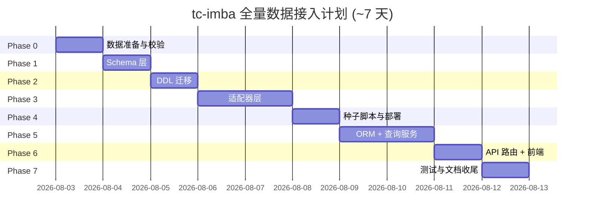

# tc-imba 全量数据接入开发计划

> 版本: v1.0 | 日期: 2026-08-02 | 状态: ✅ **全部完成（P0-P6 已实施，22 表 + S6-S10 落地）**
> 依据: [DATABASE_DESIGN_TCIMBA_V2.md](../design/DATABASE_DESIGN_TCIMBA_V2.md)（22 表）+ [TCIMBA_DATA.md](../../context/TCIMBA_DATA.md)（数据清单）
> 目标: 将 tc-imba 全量数据（帕鲁属性/技能/被动/物品/掉落/召唤）接入系统，从当前 5 表扩展为 22 表

---

## 1. 目标与范围

### 1.1 目标

在现有 5 表（`pal`/`pal_aliase`/`pal_element`/`work_suitability`/`breeding_rule`）基础上，接入 tc-imba 提供的全部数据，落地 **22 表** 设计，并开放新的查询能力（S6-S10）：

| 新场景 | 说明 |
|--------|------|
| S6 | "配出带【工匠精神】的帕鲁" — 被动 → 帕鲁反向查询 |
| S7 | "阿努比斯能学什么技能 / 等级多少" — 帕鲁技能表 |
| S8 | "骨头哪里获取 / 哪些帕鲁掉落" — 掉落双向反查 |
| S9 | "金属锭怎么做 / 需要什么材料" — 配方链 |
| S10 | "火焰羊的伙伴技能是什么" — 帕鲁详情聚合 |

### 1.2 本次范围

- 新增 17 张扩展表（`pal_stats`/`pal_friendship`/`pal_enemy_scaling`/`pal_partner_skill`/`pal_summon`/`skill`/`pal_skill`/`passive`/`passive_effect`/`passive_invoke`/`pal_passive`/`item`/`item_recipe`/`item_recipe_station`/`item_recipe_material`/`item_source`/`pal_drop`）
- `pal` 表扩展 10 个 tc-imba 列（zukan_index_suffix/genus/size/egg/nocturnal/reaction/best_work/summonable/predator/boss_first_defeat_reward）
- Schema → DDL → 适配器 → 种子脚本 → ORM → API 查询 → 前端展示（可选）全链路
- 测试（单元/集成/冒烟）与文档同步

### 1.3 非范围

- 配种公式与 `breeding_rule` 现有逻辑（已上线，保持不变）
- `items.json` 中低价值可选字段（unlockTech/equip/food/foodBuff/itemPassives/grantsSkill 等，见设计文档「已知取舍」）
- 多语言（en 之外）本地化
- 前端完整重构（仅做详情/查询入口的增量接入）

---

## 2. 现状与目标架构

### 2.1 现状数据流

```
tc-imba json (data/tc-imba/)
  ├─ convert_tcimba.py → data/processed/pal_data.json (299 帕鲁)
  │    └─ seed_docker.py (Docker entrypoint)
  │         └─ PostgresWriter (adapters/postgres) → 4 表事务
  └─ seed_breeding_rules.py → breeding_rule 表
```

### 2.2 目标数据流

```
data/tc-imba/ (pals/breeding/passives/items + locales)
  ├─ scripts/seed_tcimba_full.py (幂等)
  │    └─ adapters/tcimba/parser.py → schema 对象
  │         └─ adapters/postgres/adapter.py (扩展) → 22 表事务
  └─ (003_tcimba_extend.sql 幂等 DDL: 已有库自动补表/列)
            │
            ▼
       PostgreSQL 22 表
            │
   api/db/models.py (17 个新 ORM) + queries.py (S6-S10)
            │
   routes/query.py 新端点 → 前端(增量)
```

### 2.3 依赖顺序（关键）

```
Schema(core) → DDL(sql) → 适配器(adapters) → 种子(scripts) → ORM/查询(api) → 前端(web)
```

**DDL 执行方式注意**：现有 `data/sql/001/002` 挂载在 `docker-entrypoint-initdb.d`，**仅对新库执行**。已有 PG 卷不会重跑。因此 `003_tcimba_extend.sql` 需采用**幂等写法**（`CREATE TABLE IF NOT EXISTS` / `ALTER TABLE ... ADD COLUMN IF NOT EXISTS`），并在 `seed_tcimba_full.py` 入口或 api entrypoint 中通过 `psql -f` 对已有库执行。

---

## 3. 详细执行计划

### Phase 0: 数据准备与校验（0.5 天）

**任务**
1. 新增 `scripts/fetch_tcimba.py`：抓取 5 核心文件 + locales 到 `data/tc-imba/`（复用已抓取的 `/tmp/tc_data` 结构）
2. 新增 `scripts/validate_tcimba.py`：输出校验报告
   - 各文件条目数（pals 299 / passives 152 / skills 323 / items 2433 / combos 250）
   - 唯一性（wazaId / passiveId / itemId / 中文名无重复）
   - 数组字段确认（invoke / craftedAt 均为 list）
   - 引用完整性（activeSkills 的 wazaId、drops 的 item 都能在对应表中找到）

**涉及文件**
- `scripts/fetch_tcimba.py`（新）、`scripts/validate_tcimba.py`（新）

**验收**
- `data/tc-imba/` 数据快照完整；校验报告无致命错误（唯一性、引用完整性 OK）

---

### Phase 1: Schema 层（core）（1 天）

**任务**
1. 在 `packages/core/pl_agent/core/schema.py` 新增 dataclass（全部带 `to_dict`/`from_dict`）：
   - 帕鲁详情: `PalStats`、`PalFriendship`、`PalEnemyScaling`、`PalPartnerSkill`、`PalSummon`
   - 技能: `Skill`、`PalSkill`
   - 被动: `Passive`、`PassiveEffect`、`PassiveInvoke`、`PalPassive`
   - 物品: `Item`、`ItemRecipe`、`ItemRecipeStation`、`ItemRecipeMaterial`、`ItemSource`、`PalDrop`
2. 扩展 `Pal` / `PalRow`：新增 `predator`、`boss_first_defeat_reward`（以及 `genus`/`size`/`egg`/`nocturnal`/`reaction`/`best_work`/`summonable`）
3. 确认 `Element` 枚举覆盖 tc-imba 全部值（Normal→Neutral 映射已由 convert 处理；新增元素需校验）
4. 单元测试：`packages/core/pl_agent/core/__tests__/test_schema_ext.py`

**涉及文件**
- `packages/core/pl_agent/core/schema.py`、`packages/core/pl_agent/core/__tests__/`

**验收**
- 新 dataclass 序列化/反序列化往返一致；`make test-core` 通过
- `Pal.to_dict()` 输出含新字段，且不破坏现有字段

---

### Phase 2: DDL 迁移（data/sql）（1 天）

**任务**
1. 新增 `data/sql/003_tcimba_extend.sql`（幂等，可在已有 5 表库上重复执行）：
   - `ALTER TABLE pal ADD COLUMN IF NOT EXISTS` 10 列
   - `CREATE TABLE IF NOT EXISTS` 17 张新表（含索引、`pal_drop UNIQUE(pal_id,item_id,is_boss)`、`item_recipe_material` 等外键）
2. 同步更新 `docs/architecture/design/DATABASE_DESIGN_TCIMBA_V2.md` 的 DDL 附录为最终态（若与实现有出入）

**涉及文件**
- `data/sql/003_tcimba_extend.sql`（新）、`docs/architecture/design/DATABASE_DESIGN_TCIMBA_V2.md`

**验收**
- 空库执行 `001 → 002 → 003` 成功；已有 5 表库执行 `003` 成功（幂等，重复执行不报错）
- `\dt` 显示 22 张表；`pal` 含新列

---

### Phase 3: 适配器层（adapters）（1.5 天）

**任务**
1. 新增 `packages/adapters/adapters/tcimba/`：
   - `parser.py`：解析 `pals.json` / `passives.json` / `items.json` / `breeding.json` / locales → schema 对象
   - `adapter.py`：组装 `TciDataBundle`（pal/stats/.../item/drop 全量集合）
   - 元素/工种/本地化映射（复用 `convert_tcimba.py` 的 WORK_MAP/ELEMENT_MAP）
2. 扩展 `packages/adapters/adapters/postgres/adapter.py`：
   - 新增 `upsert_ext`（22 表事务）：写入顺序 = 主表（pal/skill/passive/item）→ 1:1 详情（pal_stats 等）→ 关联表（pal_skill/pal_passive/pal_drop/pal_summon/item_recipe/item_source/passive_effect/passive_invoke/item_recipe_material/item_recipe_station）
   - `pal_drop` 用 `ON CONFLICT (pal_id,item_id,is_boss)` 处理 drops/bossDrops 重叠
   - `invoke`/`craftedAt` 数组 → 拆行写入 `passive_invoke`/`item_recipe_station`
3. 单元测试：`packages/adapters/adapters/tcimba/__tests__/`（解析器）+ postgres 写入测试

**涉及文件**
- `packages/adapters/adapters/tcimba/`（新）、`packages/adapters/adapters/postgres/adapter.py`、`packages/adapters/adapters/postgres/__tests__/`

**验收**
- 解析器从真实 json 产出对象：299 pal / 152 passive(+effects+invokes) / 323 skill / 2433 item
- 写入器在测试库幂等（跑两次行数一致）；`pal_drop` 重叠帕鲁（Garm 等）不丢行

---

### Phase 4: 种子/导入脚本 + 部署（1 天）

**任务**
1. 新增 `scripts/seed_tcimba_full.py`：
   - 入口先执行 `003_tcimba_extend.sql`（对已有库补表/列，幂等）
   - 解析 `data/tc-imba/` → `TciDataBundle` → `upsert_ext` 全量写入
   - 保留 `seed_breeding_rules.py` 的 `breeding_rule` 灌入（或合并进本脚本）
2. 更新 `docker-compose.yml` api entrypoint：`seed_tcimba_full.py`（替代/前置 seed_docker.py + seed_breeding_rules.py）
3. 更新 `docker/api.Dockerfile`：`COPY data/tc-imba/` + `data/sql/003_*`

**涉及文件**
- `scripts/seed_tcimba_full.py`（新）、`docker-compose.yml`、`docker/api.Dockerfile`

**验收**
- `docker compose up -d --build api` 后 22 表行数吻合（299/152/323/2433 + 关联行）
- 重启容器重复执行幂等，行数不变

---

### Phase 5: ORM 模型 + 查询服务（api）（1.5 天）

**任务**
1. `packages/api/pl_agent/api/db/models.py` 新增 17 个 ORM 模型（映射 22 表，含 relationship）
2. `packages/api/pl_agent/api/db/queries.py` 新增查询：
   - `query_pals_by_passive(cn_name)`（S6）
   - `query_pal_skills(game_id)`（S7）
   - `query_pal_drops_by_item(item_name)` / `query_pal_drops(game_id)`（S8）
   - `query_recipe_chain(item_name)`（S9）
   - `query_pal_detail_full(game_id)`（S10，聚合 stats/friendship/enemy_scaling/partner_skill/summon/技能/被动/掉落）
3. 单元测试：`packages/api/pl_agent/api/db/__tests__/`（用 AsyncSession mock，沿用现有模式）

**涉及文件**
- `packages/api/pl_agent/api/db/models.py`、`queries.py`、`packages/api/pl_agent/api/db/__tests__/`

**验收**
- ORM 模型映射正确；5 个查询的单元测试通过
- `make test-api` 通过

---

### Phase 6: API 路由 + 前端（可选，1 天）

**任务**
1. `packages/api/pl_agent/api/routes/query.py` 新增端点：
   - `GET /api/pals/{game_id}/detail`（S10 全量详情）
   - `GET /api/passives?name=工匠精神`（S6）
   - `GET /api/items/{name}/recipe`（S9）
   - `GET /api/items/{name}/drops`（S8）
2. `packages/web` 增量：详情页展示技能/被动/掉落/配方（新增查询入口）

**涉及文件**
- `packages/api/pl_agent/api/routes/query.py`、`packages/web/src/...`

**验收**
- 浏览器端到端：查询"阿努比斯详情"返回技能/被动/掉落；"骨头来源"返回掉落帕鲁
- 冒烟测试 `tests/smoke/` 新增端点通过

---

### Phase 7: 测试与文档收尾（0.5 天）

**任务**
1. 全量测试：`make test-all`（单元 + 集成 + 冒烟）
2. 文档同步：
   - `docs/context/CONTEXT.md`：数据流、22 表、新查询场景
   - `docs/architecture/design/PROJECT_STRUCTURE.md`：登记 `adapters/tcimba/`、`003_tcimba_extend.sql`
   - `docs/architecture/design/DATABASE_DESIGN_TCIMBA_V2.md`：标记实现状态
   - `.github/copilot-instructions.md`：补充 tc-imba 全量数据接入规范

**涉及文件**
- 全仓相关文档 + 测试

**验收**
- `make test-all` 全绿；文档与实际代码一致

---

## 4. 里程碑与依赖



| 阶段 | 依赖 | 产出 |
|------|------|------|
| P0 数据校验 | - | `data/tc-imba/` 快照 + 校验报告 |
| P1 Schema | P0 | core 新 dataclass + 测试 |
| P2 DDL | P1 | `003_tcimba_extend.sql`（幂等）|
| P3 适配器 | P1 | `adapters/tcimba/` + `upsert_ext` |
| P4 种子部署 | P2+P3 | `seed_tcimba_full.py` + compose 更新 |
| P5 ORM/查询 | P4 | models + queries（S6-S10）|
| P6 API/前端 | P5 | 新端点 + web 增量 |
| P7 收尾 | P0-P6 | 全绿测试 + 文档同步 |

---

## 5. 关键技术点与风险

### 5.1 关键技术点

1. **DDL 幂等**：已有 PG 卷不重跑 `initdb`，`003` 必须 `IF NOT EXISTS` 且由 seed 入口执行（对已有库）。
2. **FK 写入顺序**：先主表（pal/skill/passive/item）→ 再 1:1 详情 → 最后关联表，否则外键约束报错。
3. **数组字段拆行**：`invoke`/`craftedAt` 必须拆到 `passive_invoke`/`item_recipe_station`，禁止逗号拼接。
4. **`pal_drop` 去重**：`UNIQUE(pal_id,item_id,is_boss)` + `ON CONFLICT DO UPDATE`，处理 drops/bossDrops 重叠。
5. **`is_wild` 无源**：tc-imba 无此字段，由旧数据继承或按规则推导（`summonable`/Boss 不可捕获 → False），默认 TRUE。
6. **本地化接入**：伙伴技能中文名来自 `locales/zh-CN/partnerEffects.json`（已确认存在）。

### 5.2 风险与对策

| 风险 | 等级 | 对策 |
|------|:---:|------|
| 22 表写入事务大、FK 顺序易错 | 高 | 严格按主表→详情→关联表顺序；单测覆盖幂等 |
| 已有库 DDL 不生效导致 seed 失败 | 高 | `003` 幂等 + seed 入口 psql；先空库 CI 验证 |
| `item`(2433) 与 `pal_drop` 引用完整性 | 中 | P0 校验报告预检 missing item |
| 前端改动范围失控 | 中 | Phase 6 标记可选，先保证 API 层完成 |
| 现有 113 测试回归 | 中 | 每阶段 `make test-all`；不破坏现有 Pal 字段 |

### 5.3 回滚策略

- 各阶段独立 commit；`003` 新增表/列不影响现有 5 表查询，可随时停用新端点。
- 若 seed 出问题：删除新增表数据即可（`DELETE FROM item; ...`），不影响 pal 主表。
- Phase 6 前端可选，可整体跳过保留 API。

---

## 6. 测试策略

| 层级 | 位置 | 覆盖 |
|------|------|------|
| 单元 | `packages/core/pl_agent/core/__tests__/` | schema 序列化 |
| 单元 | `packages/adapters/adapters/tcimba/__tests__/` | json 解析 |
| 单元 | `packages/adapters/adapters/postgres/__tests__/` | 22 表写入幂等 |
| 单元 | `packages/api/pl_agent/api/db/__tests__/` | S6-S10 查询（mock）|
| 集成 | `tests/integration/` | 种子脚本 → 真实 PG 22 表 |
| 冒烟 | `tests/smoke/` | 新 API 端点端到端 |

命令：`make test-core` / `make test-adapters` / `make test-api` / `make test-all`

---

## 7. 执行顺序建议（最小可行切分）

优先交付 **高价值三块**（对配种 Agent 最有价值），再补全剩余：

1. **第一批（P0-P3 被动+技能）**：接入 `passive`/`pal_passive` + `skill`/`pal_skill` → 支持 S6/S7（配种被动传承、技能查询）
2. **第二批（P2-P4 掉落+物品）**：接入 `item`/`pal_drop`/`item_recipe*`/`item_source` → 支持 S8/S9（材料反查、配方链）
3. **第三批（P1-P5 帕鲁详情）**：`pal_stats`/`pal_friendship`/`pal_enemy_scaling`/`pal_partner_skill`/`pal_summon` + `pal` 扩展列 → 支持 S10 详情聚合

每批可独立上线，互不阻塞，符合增量演进。

---

## 8. 执行记录（2026-08-02）

- [x] **P0** `scripts/fetch_tcimba.py`（13 文件抓取）+ `scripts/validate_tcimba.py`（校验：299/250/115/2433 + 引用完整性/数组字段）— 数据快照落 `data/tc-imba/`
- [x] **P1** `schema.py` 扩展 `Pal`/`PalRow` 10 列 + 新增 17 个 Row 模型 — 44 passed
- [x] **P2** `data/sql/003_tcimba_extend.sql`（幂等）— 空库 001→002→003 与已有库重复执行均 OK（24 表含旧表）
- [x] **P3** `adapters/tcimba/`（parser/adapter → TciDataBundle）+ `adapters/postgres/ext_writer.py`（22 表事务）— 真实 PG 幂等验证 + 9 单测 passed
- [x] **P4** `scripts/seed_tcimba_full.py`（内含 003 DDL 幂等应用）+ Docker entrypoint/Dockerfile 更新
- [x] **P5** `models.py` 新增 17 个 ORM + `queries.py` S6-S10 — 实测 + 6 单测 passed
- [x] **P6** 路由新端点 `/api/pals/{id}/detail` `/api/passives` `/api/items/{name}/recipe` `/api/items/{name}/drops` — TestClient 冒烟通过
- [x] **P7** 全量测试通过（adapters/core/smoke 66 + agent 47 + api 14）+ 文档同步

**实测数据规模**: pal 299 / skill 319 / pal_skill 2388 / passive 115 / passive_effect 167 / passive_invoke 115 / pal_passive 53 / item 2433 / item_recipe 1394 / item_recipe_station 3704 / item_recipe_material 3900 / item_source 4720 / pal_drop 2043 / pal_summon 5
