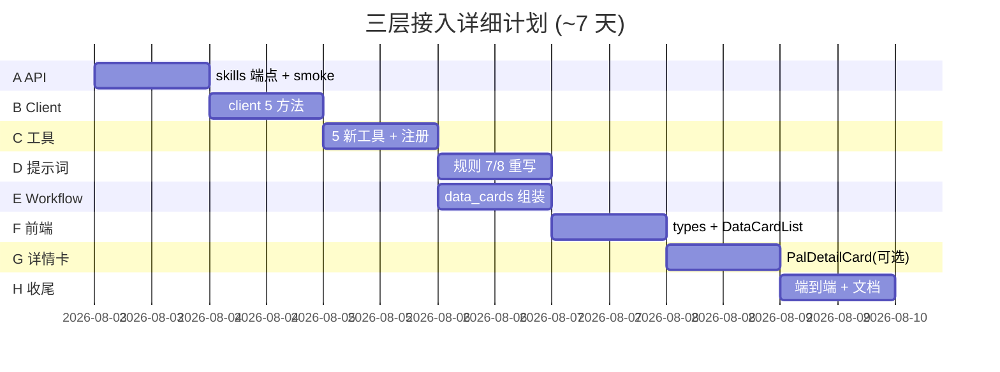

# 三层接入详细执行计划 — API / Agent / 前端 新数据能力

> 版本: v1.0 | 日期: 2026-08-02 | 状态: OK 已执行（Phase A-H 完成，工具 10 个，data_cards 上线）
> 依据: [TIER_INTEGRATION_PLAN.md](./TIER_INTEGRATION_PLAN.md)（修复后）+ [DATABASE_DESIGN_TCIMBA_V2.md](../design/DATABASE_DESIGN_TCIMBA_V2.md)
> 前置: 22 表 + S6-S10 查询已落地（feature/tcimba-22tables）

---

## 1. 目标与链路

让被动/技能/掉落/配方/详情数据通过 **Agent 对话**触达用户，并结构化展示到前端：

```
用户提问 → agent-web /agent/chat → workflow.handle_chat
        → AgentLoop (LLM function calling) → 新工具 → BreedingApiClient → API :8000 新端点
        → 工具结构化结果 → workflow 组装 data_cards → agent-web 透传 → 前端渲染卡片
```

**数据链路依赖**: API 端点（A）→ client 方法（B）→ 工具（C）→ 提示词路由（D）→ workflow 组装（E）→ 前端展示（F）

---

## 2. 详细阶段

### Phase A: API 层补齐（0.5 天）

**任务**
1. `packages/api/pl_agent/api/routes/query.py` 新增 `GET /api/pals/{pal_id}/skills`
   - 调用 `orm_service.query_pal_skills(pal_id)`（方法已存在）
   - 返回 `format_success({"pal_id": ..., "skills": [...], "total": n})`
2. `tests/smoke/` 补新端点冒烟

**涉及文件**: `routes/query.py`、`tests/smoke/`

**验收**
- `curl /api/pals/Anubis/skills` → 200，返回 9 条技能（碎石霰弹/元气弹…）

---

### Phase B: Agent client 扩展（0.5 天）

**任务** — `packages/agent/pl_agent/agent/clients/breeding_api_client.py` 新增 5 方法（均复用 `_request`）：

| 方法 | 端点 | 返回 |
|------|------|------|
| `get_pal_detail_full(pal_id) -> dict` | `GET /api/pals/{id}/detail` | 全量详情 |
| `get_pal_skills(pal_id) -> list[dict]` | `GET /api/pals/{id}/skills` | 技能列表 |
| `query_pals_by_passive(name) -> list[dict]` | `GET /api/passives?name=` | 帕鲁列表 |
| `get_item_recipe(item_name) -> list[dict]` | `GET /api/items/{name}/recipe` | 配方行 |
| `get_item_drops(item_name) -> list[dict]` | `GET /api/items/{name}/drops` | 掉落帕鲁 |

**涉及文件**: `clients/breeding_api_client.py`、`clients/__tests__/`

**验收**
- 方法调用真实 API（`/tmp` 集成脚本）返回结构化数据

---

### Phase C: Agent 新工具（1 天）

**任务** — 新建 `tools/pal_info.py`（或并入 `tools/breeding.py`），新增 5 个 `Tool` 子类；`tools/__init__.py` 的 `build_breeding_tools` 注册。

| 工具名 | 类 | 入参 | run 逻辑 |
|--------|----|------|----------|
| `query_pal_detail` | `QueryPalDetailTool` | `pal_name` | resolve_pal_name → get_pal_detail_full |
| `query_pal_skills` | `QueryPalSkillsTool` | `pal_name` | resolve → get_pal_skills |
| `query_pals_by_passive` | `QueryPalsByPassiveTool` | `passive_name` | query_pals_by_passive |
| `query_item_drops` | `QueryItemDropsTool` | `item_name` | get_item_drops |
| `query_item_recipe` | `QueryItemRecipeTool` | `item_name` | get_item_recipe |

工具 `description` 写明触发场景（如 query_item_drops: "查询某材料/物品由哪些帕鲁掉落，用于回答‘骨头哪里获得’"），`name` 沿用现有动词开头风格。

**涉及文件**: `tools/pal_info.py`（新）、`tools/__init__.py`、`tools/__tests__/`

**验收**
- 5 个工具单测（mock client）通过
- `build_breeding_tools` 返回 8 个工具（3 旧 + 5 新）

---

### Phase D: 提示词重写（0.5 天）

**任务** — `packages/agent/pl_agent/agent/prompts/assistant.md`：

1. **重写规则 7**: "石头怎么获取/木材在哪捡/金属锭怎么做" → 调用 `query_item_drops` / `query_item_recipe` 查精确数据；仅当确无数据工具覆盖的玩法知识（如"怎么抓帕鲁"）才走通用回答
2. **修正规则 8**: "权威数据库（paldb.cc）" → "tc-imba（palworld.tc-imba.com）"
3. **新增规则**: 被动类问题（"哪只帕鲁有工匠精神"）→ `query_pals_by_passive`；技能/详情类 → `query_pal_detail` / `query_pal_skills`

**涉及文件**: `prompts/assistant.md`

**验收**
- 既有"话题切换"测试更新后通过（"怎么获取"不再走通用回答，而是触发工具）

---

### Phase E: workflow 组装 data_cards（1 天）

**任务** — `packages/agent/pl_agent/agent/graph/workflow.py`：

1. `handle_chat` 内 AgentLoop 完成后，从 `AgentLoopResult.tool_calls` 提取结构化工具结果
2. 将结果归一化为 `data_cards` 列表（按工具类型 → 卡片类型）：
   - `query_pals_by_passive` → `{type: "passive", passive, pals: [...]}`
   - `query_item_drops` → `{type: "drop", item, pals: [...]}`
   - `query_item_recipe` → `{type: "recipe", item, recipe: [...]}`
   - `query_pal_detail` → `{type: "pal_detail", ...摘要}`
   - `query_pal_skills` → `{type: "skills", pal, skills: [...]}`
3. `data["data_cards"] = cards`（无则省略/空列表）

> agent-web 无需改动：`data` dict 直接透传，`data_cards` 自动随响应返回。

**涉及文件**: `graph/workflow.py`、`graph/__tests__/`

**验收**
- `handle_chat` 返回含 `data_cards` 的 dict；单测覆盖"工具调用后生成卡片"

---

### Phase F: 前端 data_cards 渲染（1.5 天）

**任务** — `packages/web/src/`：

1. `types.ts`：`AgentData` 增加 `data_cards?: DataCard[]`；新增 `DataCard` 联合类型：
   ```ts
   type DataCard =
     | { type: "passive"; passive: string; pals: Array<{pal_id: string; cn_name: string}> }
     | { type: "drop"; item: string; pals: Array<{pal_id: string; pal_cn: string; rate?: number}> }
     | { type: "recipe"; item: string; recipe: Array<{station: string; material: string; count: number}> }
     | { type: "skills"; pal: string; skills: Array<{cn_name: string; learn_level: number}> };
   ```
2. 新建 `components/DataCardList.tsx`：按 type 渲染小卡片（Passive/Drop/Recipe/Skills），独立样式不侵入 `.breed-tree`
3. `ChatPage.tsx`：在消息内（`AgentData` 到达处）渲染 `data_cards`

**涉及文件**: `types.ts`、`components/DataCardList.tsx`（新）、`pages/ChatPage.tsx`、`styles.css`

**验收**
- `npm run build` + TSC 通过
- 浏览器：问"哪只帕鲁有工匠精神"→ 被动卡片；"骨头哪里获得"→ 掉落卡片

---

### Phase G: 帕鲁详情卡（可选，1 天）

**任务**
1. `services/agentClient.ts` 新增 `fetchPalDetail(pal_id)`（复用已定义的 `apiBaseUrl`，直连 api :8000）
2. `components/PalDetailCard.tsx`：hover/点击帕鲁名 → 弹出详情（stats/技能/掉落/伙伴技能）
3. 接入 `DataCardList` 或消息内帕鲁名

**涉及文件**: `services/agentClient.ts`、`components/PalDetailCard.tsx`（新）

**验收**
- 浏览器点击帕鲁名显示详情卡

---

### Phase H: 端到端 + 收尾（1 天）

**任务**
1. 全量测试：`make test-agent` + `make test-agent-web` + `make test-api` + 前端 build
2. 端到端：本地起全栈 → 浏览器验证四类问题（被动/掉落/配方/详情）→ 卡片显示
3. 文档同步：`CONTEXT.md`（新工具/端点/data_cards）、`TIER_INTEGRATION_PLAN.md` 标记完成

**验收**
- 全绿 + 端到端通过

---

## 3. 里程碑与依赖



| 阶段 | 依赖 | 产出 |
|------|------|------|
| A API 补齐 | - | `/api/pals/{id}/skills` |
| B Client | A | client 5 方法 |
| C 工具 | B | 5 新工具（总 8 个）|
| D 提示词 | C | 规则 7/8 重写 + 新增 |
| E Workflow | C | `data_cards` 组装 |
| F 前端 | E | DataCardList + types |
| G 详情卡 | F | PalDetailCard（可选）|
| H 收尾 | D+E+F | 全绿 + 端到端 |

---

## 4. 测试策略

| 层 | 测试 | 覆盖 |
|----|------|------|
| API | `tests/smoke/` | `/api/pals/{id}/skills` 200 |
| Client | `clients/__tests__/`（mock httpx）| 5 方法请求路径/解析 |
| 工具 | `tools/__tests__/`（mock client）| 5 工具 run + 错误分支 |
| Agent | `graph/__tests__/` | handle_chat 组装 data_cards |
| Agent 集成 | mock LLM 触发工具 | "骨头怎么获取" → 工具调用 + 卡片 |
| 前端 | `npm run build` + TSC | types 正确、组件渲染 |
| 端到端 | 浏览器 | 四类问题 → 卡片显示 |

---

## 5. 风险与对策

| 风险 | 等级 | 对策 |
|------|:---:|------|
| 规则 7 行为改变影响既有"话题切换"测试 | 中 | D 阶段同步更新 agent 测试；仅"无数据覆盖的玩法知识"走通用回答 |
| 工具增至 8 个增加 function calling 复杂度 | 低 | description 精确；新工具归 `pal_info.py` 分文件 |
| data_cards 与配种树渲染冲突 | 中 | 独立 `DataCardList` 组件 + 独立样式类 |
| 前端 AgentData 结构变更引发 TS 错误 | 低 | data_cards 为可选字段，向后兼容 |
| 上游 API 端点 404（skills 未补）| 中 | 严格按 A→B 顺序，先补端点再写 client |

---

## 6. 回滚策略

- A/B/C 各阶段独立 commit；新工具不注册即可回退到 3 工具
- data_cards 为可选字段：前端不渲染即无影响
- D 提示词改动可回退到旧 assistant.md（git 历史）

---

## 7. 执行记录（2026-08-02）

- [x] **A**: `routes/query.py` 新增 `/api/pals/{id}/skills`（调已存在的 `query_pal_skills`）— TestClient 验证 200 + PAL_NOT_FOUND
- [x] **B**: `breeding_api_client.py` 新增 5 方法 — 7 单测 passed
- [x] **C**: 新建 `tools/pal_info.py` 5 个工具 + 注册 `build_breeding_tools`（总 9 个）— 7 单测 passed
- [x] **D**: `assistant.md` 规则 7 重写（资源/物品走工具）+ 规则 8 改 tc-imba + 新增规则 9 — 28 agent 测试无回归
- [x] **E**: `presenter.build_data_cards` + `workflow.handle_chat` 注入 data_cards — 8 单测 + 4 集成 passed
- [x] **F**: 前端 `types.ts` DataCard 类型 + `components/DataCardList.tsx` + `MessageList` 渲染 + 样式 — TSC + build 通过
- [ ] **G**: PalDetailCard 独立弹窗（**可选延后**；`query_pal_detail` 已通过 data_cards 渲染摘要卡，覆盖核心场景）
- [x] **H**: 全量 130 passed（core/adapters/api/agent/agent-web）+ 前端 build

**说明**: 实际工具总数为 **9 个**（4 旧 + 5 新），非计划的 8 个（旧工具含 `query_pal_stats`）。
